# OneVice Architecture Diagrams

**Version:** 2.0  
**Date:** September 1, 2025  
**Status:** Design Complete

## 1. System Component Architecture

```mermaid
graph TB
    subgraph "Presentation Layer"
        UI[Next.js 15.4 Frontend<br/>React 19 + TypeScript 5.6<br/>Glassmorphic Design System<br/>Real-time WebSocket]
        Mobile[Mobile Web Interface<br/>Responsive Design<br/>Touch Optimized]
    end
    
    subgraph "Authentication & Security Layer"
        Clerk[Clerk Authentication<br/>JWT Token Management<br/>User Profile Management]
        Okta[Okta SSO Integration<br/>Enterprise Directory<br/>Role Synchronization]
        RBAC[RBAC Enforcement<br/>6-Level Data Sensitivity<br/>Role-Based Filtering]
    end
    
    subgraph "API & Gateway Layer"
        Gateway[FastAPI 0.115.x Gateway<br/>Request Validation<br/>Rate Limiting<br/>WebSocket Management]
        LB[Load Balancer<br/>HAProxy/Nginx<br/>SSL Termination<br/>Health Checking]
    end
    
    subgraph "AI Agent Orchestration Layer"
        Supervisor[LangGraph Supervisor<br/>Agent Routing<br/>Workflow Coordination]
        
        subgraph "Specialized AI Agents"
            SA[Sales Intelligence Agent<br/>• Contact Research<br/>• Company Analysis<br/>• Relationship Mapping]
            CSA[Case Study Agent<br/>• Project Matching<br/>• Template Generation<br/>• Portfolio Assembly]
            TDA[Talent Discovery Agent<br/>• Multi-faceted Search<br/>• Availability Prediction<br/>• Skill Matching]
            BSA[Bidding Support Agent<br/>• Union Rule Integration<br/>• Budget Analysis<br/>• Risk Assessment]
        end
        
        SFN[Security Filtering Node<br/>Role-Based Response Filtering<br/>Data Sensitivity Control<br/>Audit Logging]
        
        Memory[LangMem Memory Management<br/>User Profiles<br/>Episode Learning<br/>Domain Knowledge]
    end
    
    subgraph "Data & Knowledge Layer"
        Graph[Neo4j 5.25.x Graph Database<br/>Entertainment Industry Ontology<br/>Vector Search Integration<br/>Relationship Analytics]
        
        Cache[Redis 7.4.x Cache Layer<br/>Session Management<br/>Query Result Caching<br/>Message Queuing]
        
        Vector[Vector Store<br/>Document Embeddings<br/>Semantic Search<br/>Similarity Matching]
    end
    
    subgraph "LLM & AI Layer"
        Router[LLM Router<br/>Model Selection<br/>Cost Optimization<br/>Load Distribution]
        
        Local[Local Llama<br/>Sensitive Data Processing<br/>On-Premise Inference<br/>Privacy Compliance]
        
        Claude[Anthropic Claude<br/>Complex Reasoning<br/>Strategic Analysis<br/>Natural Language]
        
        Gemini[Google Gemini<br/>Multimodal Processing<br/>Long Context Analysis<br/>Document Understanding]
    end
    
    subgraph "External Integration Layer"
        Unions[Union APIs<br/>IATSE<br/>DGA<br/>SAG-AFTRA<br/>Local 399]
        
        Industry[Industry Data Sources<br/>IMDb Pro<br/>The Numbers<br/>Box Office Mojo<br/>Variety Intelligence]
        
        Talent[Talent Databases<br/>Casting Networks<br/>Agency Rosters<br/>Union Directories]
    end
    
    subgraph "Infrastructure & Monitoring Layer"
        Observability[LangSmith Observability<br/>Performance Monitoring<br/>Cost Tracking<br/>Quality Metrics]
        
        Logging[Centralized Logging<br/>Audit Trails<br/>Error Tracking<br/>Security Events]
        
        Backup[Backup & Recovery<br/>Data Replication<br/>Disaster Recovery<br/>Business Continuity]
    end
    
    UI --> Gateway
    Mobile --> Gateway
    Gateway --> Clerk
    Clerk --> Okta
    Gateway --> Supervisor
    
    Supervisor --> SA
    Supervisor --> CSA
    Supervisor --> TDA
    Supervisor --> BSA
    Supervisor --> Memory
    
    SA --> SFN
    CSA --> SFN
    TDA --> SFN
    BSA --> SFN
    
    SFN --> Graph
    Memory --> Cache
    Graph --> Vector
    
    Supervisor --> Router
    Router --> Local
    Router --> Claude
    Router --> Gemini
    
    BSA --> Unions
    SA --> Industry
    TDA --> Talent
    
    Gateway -.-> Observability
    SFN -.-> Logging
    Graph -.-> Backup
    
    style UI fill:#1e293b,stroke:#3b82f6,stroke-width:2px
    style Supervisor fill:#065f46,stroke:#10b981,stroke-width:2px
    style Graph fill:#7c2d12,stroke:#ea580c,stroke-width:2px
    style Router fill:#581c87,stroke:#a855f7,stroke-width:2px
```



## 2. Data Flow Architecture


## 3. Database Schema Relationships


## 4. Authentication & Authorization Flow


## 5. Multi-Agent Workflow Architecture

```mermaid
graph TD
    subgraph "Query Processing"
        Query[User Query<br/>Natural Language Input]
        Classification[Query Classification<br/>Intent Analysis<br/>Entity Extraction]
        Routing[Agent Routing<br/>Best Agent Selection<br/>Confidence Scoring]
    end
    
    subgraph "LangGraph Supervisor Pattern"
        Supervisor[Supervisor Node<br/>Workflow Coordination<br/>State Management]
        
        subgraph "AI Agent Pool"
            Sales[Sales Intelligence Agent<br/>🎯 Contact Research<br/>🏢 Company Analysis<br/>📊 Market Intelligence]
            
            Case[Case Study Agent<br/>📁 Project Similarity<br/>🎨 Creative Matching<br/>📋 Portfolio Assembly]
            
            Talent[Talent Discovery Agent<br/>👥 Multi-faceted Search<br/>📅 Availability Checking<br/>🎭 Skill Assessment]
            
            Bidding[Bidding Support Agent<br/>💰 Budget Analysis<br/>⚖️ Union Rule Integration<br/>📈 Risk Assessment]
        end
        
        Security[Security Filtering Node<br/>🔒 RBAC Enforcement<br/>🛡️ Data Sensitivity Filter<br/>📝 Audit Logging]
        
        Memory[LangMem Memory Node<br/>🧠 User Profile Management<br/>📚 Episode Learning<br/>🎭 Domain Knowledge]
    end
    
    subgraph "Knowledge Sources"
        Graph[Neo4j Knowledge Graph<br/>👤 Person Relationships<br/>🎬 Project History<br/>🏢 Organization Data]
        
        Vector[Vector Store<br/>📄 Document Embeddings<br/>🔍 Semantic Search<br/>📊 Similarity Matching]
        
        External[External APIs<br/>⚖️ Union Rules (IATSE, DGA)<br/>🎬 Industry Data (IMDb)<br/>📊 Market Intelligence]
    end
    
    subgraph "Response Processing"
        Synthesis[Response Synthesis<br/>Multi-source Integration<br/>Context Aggregation<br/>Quality Validation]
        
        Streaming[Real-time Streaming<br/>WebSocket Delivery<br/>Chunk Processing<br/>Live Updates]
        
        Caching[Result Caching<br/>Performance Optimization<br/>Future Query Acceleration<br/>Role-based Storage]
    end
    
    Query --> Classification --> Routing --> Supervisor
    
    Supervisor --> Sales
    Supervisor --> Case
    Supervisor --> Talent
    Supervisor --> Bidding
    
    Sales --> Graph
    Sales --> External
    Case --> Graph
    Case --> Vector
    Talent --> Graph
    Talent --> External
    Bidding --> Graph
    Bidding --> External
    
    Sales --> Security
    Case --> Security
    Talent --> Security
    Bidding --> Security
    
    Security --> Memory
    Security --> Synthesis
    
    Memory --> Graph
    Memory --> Vector
    
    Synthesis --> Streaming --> Caching
    
    style Supervisor fill:#065f46,stroke:#10b981,stroke-width:3px
    style Security fill:#7c2d12,stroke:#ea580c,stroke-width:3px
    style Graph fill:#1e40af,stroke:#3b82f6,stroke-width:2px
    style Memory fill:#581c87,stroke:#a855f7,stroke-width:2px
```

## 6. Real-Time Communication Architecture


## 7. Security Architecture Layers


## 8. Performance & Scalability Architecture


## 9. Deployment & DevOps Architecture


## 10. Memory Management Architecture

```mermaid
graph TB
    subgraph "LangMem Memory Types"
        UserMem[User Profile Memory<br/>👤 Preferences & Context<br/>📊 Interaction Patterns<br/>🎯 Communication Style]
        
        EpisodeMem[Episodic Memory<br/>✅ Successful Interactions<br/>📈 Learning Patterns<br/>🔄 Strategy Optimization]
        
        SemanticMem[Semantic Memory<br/>🎭 Domain Knowledge<br/>⚖️ Union Rules<br/>💰 Budget Practices]
        
        ProjectMem[Project Context Memory<br/>🎬 Project-specific Insights<br/>👥 Team Preferences<br/>📋 Lessons Learned]
    end
    
    subgraph "Memory Operations"
        Extract[Memory Extraction<br/>Background Processing<br/>Pattern Recognition<br/>Knowledge Distillation]
        
        Store[Memory Storage<br/>Vector Indexing<br/>Namespace Management<br/>Conflict Resolution]
        
        Retrieve[Memory Retrieval<br/>Similarity Search<br/>Context Ranking<br/>Relevance Scoring]
        
        Update[Memory Updates<br/>Incremental Learning<br/>Fact Correction<br/>Preference Evolution]
    end
    
    subgraph "Memory Persistence"
        Redis[Redis Memory Store<br/>Session Persistence<br/>Fast Access<br/>Distributed Caching]
        
        Vector[Vector Database<br/>Embedding Storage<br/>Similarity Search<br/>Semantic Indexing]
        
        Archive[Long-term Archive<br/>Historical Data<br/>Compliance Storage<br/>Analytical Access]
    end
    
    subgraph "Memory Integration"
        QueryEnhance[Query Enhancement<br/>Context Integration<br/>Personalization<br/>Historical Awareness]
        
        ResponsePersonalize[Response Personalization<br/>Style Adaptation<br/>Preference Application<br/>Context Awareness]
        
        Learning[Continuous Learning<br/>Pattern Discovery<br/>Success Optimization<br/>Failure Analysis]
    end
    
    UserMem --> Extract --> Store --> Redis
    EpisodeMem --> Extract --> Store --> Vector
    SemanticMem --> Extract --> Store --> Archive
    ProjectMem --> Extract --> Store --> Redis
    
    Redis --> Retrieve --> QueryEnhance
    Vector --> Retrieve --> ResponsePersonalize
    Archive --> Retrieve --> Learning
    
    Extract --> Update --> Store
    
    style UserMem fill:#065f46,stroke:#10b981,stroke-width:2px
    style Extract fill:#7c2d12,stroke:#ea580c,stroke-width:2px
    style Redis fill:#581c87,stroke:#a855f7,stroke-width:2px
    style QueryEnhance fill:#1e40af,stroke:#3b82f6,stroke-width:2px
```



## 11. External Integration Architecture


## 12. Technology Stack Integration


---

**Document Status**: Architecture Diagrams Complete  
**Supporting Documentation**: system-architecture.md  
**Next Phase**: Technical implementation planning