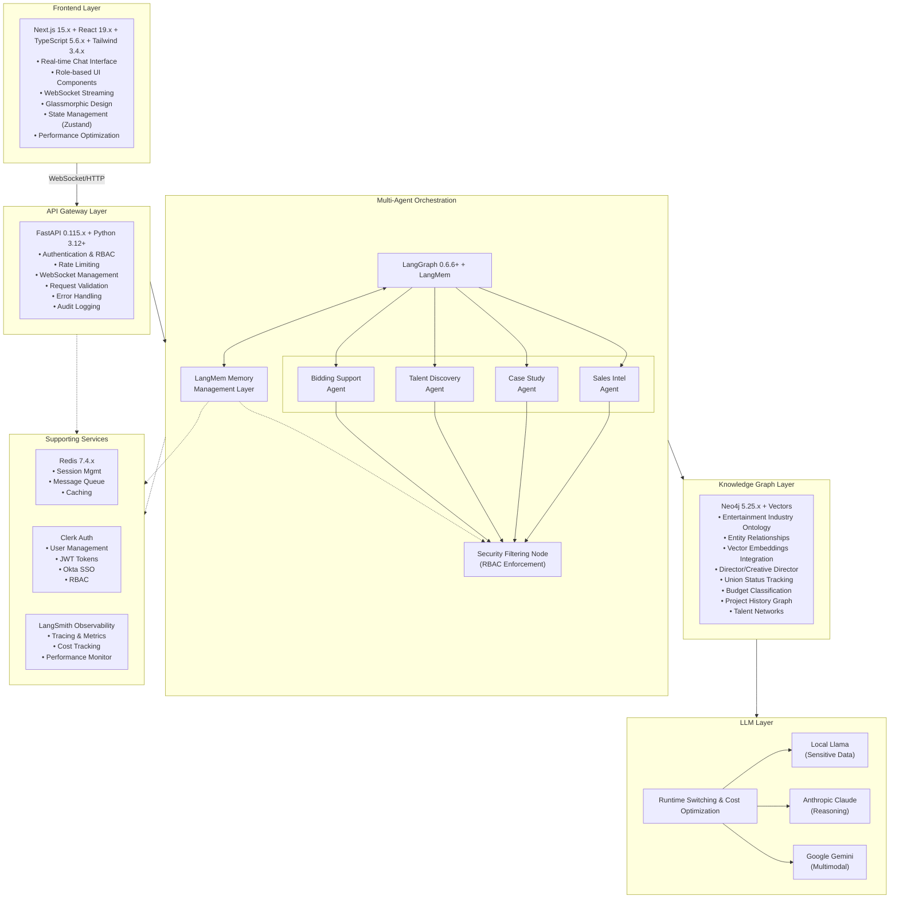
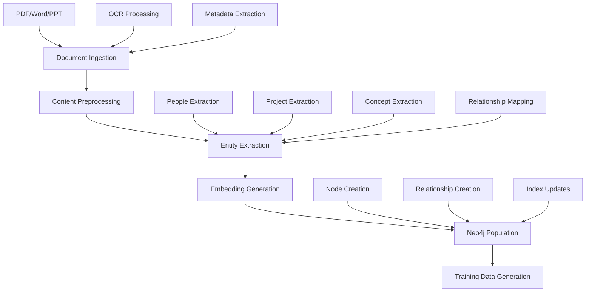

# OneVice AI-Powered Business Intelligence Hub - Technical Specification

**Version:** 1.0  
**Date:** September 1, 2025  
**Status:** Approved for Development

## 1. Executive Summary

The OneVice AI-Powered Business Intelligence Hub is a secure, centralized intelligence platform designed to transform ~200 archived documents into a strategic, queryable GraphRAG system. This specification details the technical architecture for building an enterprise-grade AI platform that empowers Sales, Creative, Production, and Management teams with real-time access to institutional knowledge while maintaining strict security and role-based access controls.

### 1.1 Core Business Value
- Transform fragmented institutional knowledge into strategic asset
- Enable faster, data-driven decision making
- Improve competitive bidding strategies through historical analysis
- Provide secure, role-based access to sensitive production data

### 1.2 Technical Approach
- Multi-agent LangGraph orchestration with specialized AI agents
- Neo4j GraphRAG system with vector search capabilities
- Real-time WebSocket communication with streaming responses
- Private LLM deployment with runtime switching for security
- Entertainment industry-specific entity extraction and ontology

## 2. System Architecture

### 2.1 High-Level Architecture



### 2.2 Technology Stack (Latest Versions - August 2025)

#### Backend Stack
- **Python 3.12+**: Latest Python with performance improvements
- **LangGraph 0.6.6+**: Multi-agent orchestration with supervisor patterns
- **LangMem SDK**: Advanced memory management (February 2025 release)
- **FastAPI 0.115.x**: High-performance API framework with WebSocket support
- **Neo4j 5.25.x**: Graph database with vector search capabilities
- **Node.js 20+ LTS**: Latest Node.js runtime
- **Python 3.12+**: Latest Python with performance improvements
- **Neo4j Python Driver 6.0+**: Latest driver with async support
- **Redis 7.4.x**: In-memory data store for caching and sessions
- **Clerk**: Modern authentication with Email + Okta SSO integration
- **LangSmith**: LLM observability and optimization

#### Frontend Stack
- **Next.js 15.4**: React framework with App Router and Turbopack
- **React 19**: Stable release with concurrent features
- **TypeScript 5.6.x**: Type-safe JavaScript development
- **Tailwind CSS 3.4.x**: Utility-first CSS framework
- **Zustand**: Lightweight state management
- **React 19 Concurrent Features**: Suspense, transitions, streaming

#### LLM Providers
- **Local Llama** (via Ollama/vLLM): For sensitive data processing
- **Anthropic Claude**: For complex reasoning tasks
- **Google Gemini**: For long context and multimodal processing
- **Runtime Switching**: Intelligent model selection based on query type

## 3. LangMem Memory Management Integration

### 3.1 Memory Architecture Overview

The OneVice AI-Powered Business Intelligence Hub integrates **LangMem SDK** as a core component for advanced conversational memory management. LangMem enables our multi-agent system to:

- **Remember user preferences and context** across sessions
- **Learn from successful interactions** to improve future responses
- **Maintain conversation history** with semantic understanding
- **Store domain-specific knowledge** about entertainment industry practices
- **Enable cross-agent memory sharing** for collaborative intelligence

### 3.2 Memory Types and Use Cases

#### 3.2.1 User Profile Memory
```python
from langmem import create_memory_manager
from pydantic import BaseModel

class UserProfile(BaseModel):
    """User profile schema for personalized interactions"""
    name: str
    role: str  # Leadership, Director, Salesperson, Creative Director
    preferences: Dict[str, Any]
    project_access: List[str]  # Project IDs user has access to
    communication_style: str
    expertise_areas: List[str]
    recent_queries: List[str]
    
# Initialize profile manager
profile_manager = create_memory_manager(
    "anthropic:claude-3-5-sonnet-latest",
    schemas=[UserProfile],
    instructions="Extract and maintain user preferences, role information, and interaction patterns",
    enable_inserts=False  # Update existing profile only
)
```

#### 3.2.2 Episodic Memory for Agent Learning
```python
class SuccessfulInteraction(BaseModel):
    """Capture successful agent interactions for learning"""
    agent_type: str  # sales_intel, case_study, talent_discovery, bidding
    query_pattern: str
    solution_approach: str
    outcome_quality: float
    user_satisfaction: str
    context_factors: List[str]
    lessons_learned: str
    
episodic_manager = create_memory_manager(
    "anthropic:claude-3-5-sonnet-latest",
    schemas=[SuccessfulInteraction],
    instructions="Extract successful interaction patterns and strategies for agent improvement",
    enable_inserts=True
)
```

#### 3.2.3 Semantic Memory for Domain Knowledge
```python
class EntertainmentKnowledge(BaseModel):
    """Domain-specific entertainment industry knowledge"""
    concept: str
    category: str  # union_rules, budget_practices, talent_info, industry_trends
    description: str
    source: str
    confidence: float
    last_updated: datetime
    related_concepts: List[str]
    
semantic_manager = create_memory_manager(
    "anthropic:claude-3-5-sonnet-latest",
    schemas=[EntertainmentKnowledge],
    instructions="Extract and organize entertainment industry knowledge and best practices",
    enable_inserts=True,
    enable_deletes=True
)
```

### 3.3 Memory Store Architecture

```python
from langgraph.store.memory import InMemoryStore
from langmem import create_manage_memory_tool, create_search_memory_tool

# Initialize memory store with vector indexing
memory_store = InMemoryStore(
    index={
        "dims": 1536,  # OpenAI text-embedding-3-small
        "embed": "openai:text-embedding-3-small"
    }
)

# Memory namespaces for different data types
MEMORY_NAMESPACES = {
    "user_profiles": ("profiles", "{user_id}"),
    "agent_episodes": ("episodes", "{agent_type}"),
    "domain_knowledge": ("knowledge", "entertainment"),
    "project_memories": ("projects", "{project_id}"),
    "talent_profiles": ("talent", "{person_id}"),
    "client_preferences": ("clients", "{org_id}")
}

# Create memory tools for each namespace
memory_tools = {}
for memory_type, namespace in MEMORY_NAMESPACES.items():
    memory_tools[f"manage_{memory_type}"] = create_manage_memory_tool(namespace)
    memory_tools[f"search_{memory_type}"] = create_search_memory_tool(namespace)
```

### 3.4 LangMem Integration with LangGraph Agents

```python
from langgraph.prebuilt import create_react_agent
from langgraph.config import get_store

def create_memory_enhanced_prompt(agent_type: str):
    """Create prompt function with memory retrieval"""
    def prompt(state):
        store = get_store()
        user_id = state.get("user_id")
        
        # Retrieve user profile
        profile_results = store.search(
            ("profiles", user_id),
            query="user preferences and context"
        )
        profile_context = profile_results[0].value if profile_results else None
        
        # Retrieve relevant episodic memories
        episode_results = store.search(
            ("episodes", agent_type),
            query=state["messages"][-1].content,
            limit=3
        )
        
        # Retrieve domain knowledge
        knowledge_results = store.search(
            ("knowledge", "entertainment"),
            query=state["messages"][-1].content,
            limit=5
        )
        
        # Construct system message with memory context
        system_msg = f"""You are a specialized {agent_type} agent for the entertainment industry.
        
        ## User Profile:
        {profile_context if profile_context else "No profile available"}
        
        ## Relevant Past Experiences:
        {format_episode_memories(episode_results)}
        
        ## Domain Knowledge:
        {format_knowledge_memories(knowledge_results)}
        
        Use this context to provide personalized, informed responses while following RBAC rules.
        """
        
        return [{"role": "system", "content": system_msg}] + state["messages"]
    
    return prompt

# Create agent with memory integration
sales_intel_agent = create_react_agent(
    "anthropic:claude-3-5-sonnet-latest",
    prompt=create_memory_enhanced_prompt("sales_intel"),
    tools=[
        # Standard tools
        neo4j_query_tool,
        document_search_tool,
        # Memory tools
        memory_tools["manage_user_profiles"],
        memory_tools["search_agent_episodes"],
        memory_tools["search_domain_knowledge"]
    ],
    store=memory_store
)
```

### 3.5 Memory Persistence and Background Processing

```python
from langmem import ReflectionExecutor, create_memory_store_manager

class MemoryOrchestrator:
    def __init__(self):
        self.background_managers = {
            "profile_updater": create_memory_store_manager(
                "anthropic:claude-3-5-sonnet-latest",
                namespace=("profiles", "{user_id}"),
                schemas=[UserProfile]
            ),
            "episode_extractor": create_memory_store_manager(
                "anthropic:claude-3-5-sonnet-latest",
                namespace=("episodes", "{agent_type}"),
                schemas=[SuccessfulInteraction]
            ),
            "knowledge_consolidator": create_memory_store_manager(
                "anthropic:claude-3-5-sonnet-latest",
                namespace=("knowledge", "entertainment"),
                schemas=[EntertainmentKnowledge]
            )
        }
    
    async def process_interaction_background(
        self,
        user_id: str,
        agent_type: str,
        conversation: List[Dict],
        outcome_metrics: Dict
    ):
        """Process conversation for memory extraction in background"""
        
        # Update user profile
        await self.background_managers["profile_updater"].ainvoke(
            {"messages": conversation},
            config={"configurable": {"user_id": user_id}}
        )
        
        # Extract successful patterns if interaction was successful
        if outcome_metrics.get("success_score", 0) > 0.8:
            await self.background_managers["episode_extractor"].ainvoke(
                {
                    "messages": conversation,
                    "metadata": outcome_metrics
                },
                config={"configurable": {"agent_type": agent_type}}
            )
        
        # Extract domain knowledge
        await self.background_managers["knowledge_consolidator"].ainvoke(
            {"messages": conversation}
        )
```

### 3.6 Memory-Driven Query Enhancement

```python
class QueryEnhancer:
    """Enhance queries using memory context"""
    
    async def enhance_query(
        self,
        original_query: str,
        user_context: Dict,
        memory_store
    ) -> str:
        """Enhance query with relevant memory context"""
        
        # Search for similar past queries
        similar_queries = memory_store.search(
            ("profiles", user_context["user_id"]),
            query=original_query,
            limit=3
        )
        
        # Get user preferences that might affect the query
        preferences = memory_store.search(
            ("profiles", user_context["user_id"]),
            query="preferences communication style"
        )
        
        # Enhance query with context
        enhanced_query = f"""{original_query}
        
        [Context from memory]
        User role: {user_context.get('role')}
        Similar past queries: {[q.value for q in similar_queries]}
        User preferences: {[p.value for p in preferences]}
        """
        
        return enhanced_query
```

## 4. Multi-Agent System Design

### 4.1 Agent Architecture Overview

The system employs a **Supervisor Pattern** with four specialized agents, a security filtering node, and **LangMem SDK** for advanced memory management (detailed in Section 3):

```python
# LangGraph Agent State Schema with LangMem Integration
class AgentState(TypedDict):
    messages: Annotated[Sequence[BaseMessage], add_messages]
    user_id: str
    role: str  # Leadership, Director, Salesperson, Creative Director
    query_type: str  # sales_intelligence, case_study, talent_discovery, bidding
    context: Dict[str, Any]
    security_level: str  # high, medium, low
    processed_entities: List[Dict]
    confidence_scores: Dict[str, float]
    next_agent: Optional[str]
    # LangMem memory integration
    user_memories: List[ExtractedMemory]  # User-specific memories
    conversation_context: Dict[str, Any]   # Current conversation context
    memory_namespace: Tuple[str, ...]     # Namespace for memory storage
```

### 4.2 Specialized Agents

#### 3.2.1 Sales Intelligence Agent
**Purpose**: Automate research for sales calls and client interactions

**Capabilities**:
- Contact and company background research
- Project history analysis
- Industry trend identification
- Competitive landscape mapping

**Key Tools**:
- Neo4j query interface for relationship traversal
- External API integrations (company databases)
- Document retrieval and summarization
- Contact enrichment services
- **LangMem memory tools** for storing and retrieving sales interactions

**Example Workflow with LangMem**:
```python
async def sales_intelligence_workflow(state: AgentState) -> AgentState:
    query = extract_query(state.messages)
    
    # 1. Retrieve relevant memories from previous interactions
    relevant_memories = await search_user_memories(
        namespace=("sales_intel", state["user_id"]),
        query=query,
        limit=5
    )
    
    # 2. Extract contact/company entities
    entities = await extract_entities(query, ["PERSON", "ORGANIZATION"])
    
    # 3. Graph traversal for relationships
    relationships = await neo4j_traversal(entities, depth=3)
    
    # 4. Historical project analysis enhanced with memories
    project_history = await analyze_project_history(entities, relevant_memories)
    
    # 5. Generate comprehensive brief
    brief = await generate_sales_brief(relationships, project_history, relevant_memories)
    
    # 6. Store new insights as memories
    await store_interaction_memory(
        namespace=("sales_intel", state["user_id"]),
        interaction={
            "query": query,
            "entities": entities,
            "insights": brief,
            "timestamp": datetime.utcnow()
        }
    )
    
    return {
        **state, 
        "processed_entities": entities, 
        "response": brief,
        "user_memories": relevant_memories
    }
```

#### 3.2.2 Case Study Compilation Agent
**Purpose**: Rapidly assemble pitch materials and project examples

**Capabilities**:
- Project similarity matching
- Creative concept clustering
- Budget tier analysis
- Client preference mapping

**Key Tools**:
- Vector similarity search
- Graph pattern matching
- Template generation
- Asset retrieval system
- **LangMem episodic memory** for learning from successful case studies

#### 3.2.3 Talent Discovery Agent
**Purpose**: Advanced internal search for production needs

**Capabilities**:
- Multi-faceted talent queries
- Role history analysis
- Budget tier filtering
- Union status tracking
- Availability prediction

**Key Tools**:
- Complex Cypher query generation
- Skill and experience matching
- Network analysis
- Scheduling integration
- **LangMem profile management** for talent preferences and history

#### 3.2.4 Bidding Support Agent
**Purpose**: Data-driven bid proposal creation

**Capabilities**:
- Union rule integration (IATSE, DGA, Local 399)
- Budget analysis and forecasting
- Risk assessment
- Competitive positioning

**Key Tools**:
- Union database APIs
- Budget calculation engines
- Risk modeling
- Historical bid analysis
- **LangMem procedural memory** for bidding strategies and lessons learned

**Critical Implementation**:
```python
class UnionRuleIntegration:
    def __init__(self):
        self.union_apis = {
            "IATSE": IATSEAPIClient(),
            "DGA": DGAAPIClient(),
            "LOCAL_399": Local399APIClient()
        }
    
    async def get_current_rules(self, state: str, project_type: str):
        """Fetch real-time union rules for location and project type"""
        rules = {}
        for union, client in self.union_apis.items():
            try:
                rules[union] = await client.get_rules(state, project_type)
            except Exception as e:
                logger.error(f"Failed to fetch {union} rules: {e}")
                rules[union] = await self.get_cached_rules(union, state)
        return rules
```

### 4.3 Security Filtering Node

**Purpose**: Enforce role-based access control on all responses

**Implementation**:
```python
async def security_filter_node(state: AgentState) -> AgentState:
    user_role = state["role"]
    response = state.get("response", "")
    
    if user_role in ["Salesperson", "Creative Director"]:
        # Filter exact budget amounts, keep ranges
        filtered_response = filter_budget_details(response)
        # Remove internal financial data
        filtered_response = remove_financial_data(filtered_response)
    elif user_role == "Director":
        # Project-specific access for attached projects
        filtered_response = filter_by_project_access(response, state["user_id"])
    else:  # Leadership role
        filtered_response = response  # Full access
    
    return {**state, "response": filtered_response}
```

## 5. GraphRAG System Architecture

### 4.1 Neo4j Schema Design

#### 4.1.1 Core Node Types

```cypher
// Person nodes with role distinction
CREATE CONSTRAINT person_id FOR (p:Person) REQUIRE p.id IS UNIQUE;
CREATE INDEX person_name FOR (p:Person) ON (p.name);

// Critical: Director vs Creative Director distinction
(:Person {
    id: "uuid",
    name: "String",
    role_type: "Director" | "Creative Director" | "Talent" | "Client",
    specialization: ["Music Video", "Commercial", "Brand Film"],
    union_status: "Union" | "Non-Union" | "Unknown",
    contact_info: {...},
    bio: "String"
})

// Project nodes
(:Project {
    id: "uuid",
    name: "String",
    type: "Music Video" | "Commercial" | "Brand Film",
    budget_tier: "$0-50k" | "$50k-100k" | "$100k-300k" | "$300k+",
    exact_budget: Float,  // Restricted based on role
    union_status: "Union" | "Non-Union" | "Mixed",
    completion_date: Date,
    status: "Completed" | "In Production" | "Pitched"
})

// Organization nodes
(:Organization {
    id: "uuid",
    name: "String",
    type: "Production Company" | "Client Brand" | "Agency" | "Union",
    industry: "String",
    tier: "Enterprise" | "Mid-Market" | "Startup"
})

// Creative Concept nodes
(:CreativeConcept {
    id: "uuid",
    concept: "String",
    category: "Visual Style" | "Narrative" | "Technical" | "Thematic",
    description: "String",
    tags: ["String"]
})

// Document nodes
(:Document {
    id: "uuid",
    title: "String",
    type: "Treatment" | "Pitch Deck" | "Budget" | "Contract",
    sensitivity_level: 1-6,  // Based on hierarchy
    created_date: Date,
    full_text_content: "String"
})
```

#### 4.1.2 Relationship Types

```cypher
// Core relationships
(:Person)-[:DIRECTED]->(:Project)
(:Person)-[:CREATIVE_DIRECTED]->(:Project)  // Key distinction
(:Person)-[:PERFORMED_IN]->(:Project)
(:Person)-[:WORKS_FOR]->(:Organization)
(:Project)-[:FOR_CLIENT]->(:Organization)
(:Project)-[:INCORPORATES]->(:CreativeConcept)
(:Document)-[:DESCRIBES]->(:Project)
(:Document)-[:MENTIONS]->(:Person)

// Advanced relationships
(:Person)-[:COLLABORATED_WITH]->(:Person) {projects: ["uuid"], frequency: Int}
(:Project)-[:SIMILAR_TO]->(:Project) {similarity_score: Float, aspects: ["String"]}
(:CreativeConcept)-[:RELATED_TO]->(:CreativeConcept) {strength: Float}
```

### 4.2 Vector Integration

```python
# Vector embeddings stored as node properties
class VectorEmbedding:
    def __init__(self):
        self.dimensions = 1536  # OpenAI ada-002
        
    async def generate_embeddings(self, content: str, content_type: str):
        """Generate multiple embedding types for different search scenarios"""
        embeddings = {}
        
        # Semantic content embedding
        embeddings['content'] = await openai_embed(content)
        
        # Entity-focused embedding
        entities = extract_entities(content)
        embeddings['entities'] = await openai_embed(' '.join(entities))
        
        # Creative concept embedding
        concepts = extract_concepts(content)
        embeddings['concepts'] = await openai_embed(' '.join(concepts))
        
        return embeddings

# Neo4j vector index configuration
CREATE VECTOR INDEX document_content_vector 
FOR (d:Document) ON d.content_embedding 
OPTIONS {indexConfig: {
    `vector.dimensions`: 1536,
    `vector.similarity_function`: 'cosine'
}};
```

### 4.3 Hybrid Search Implementation

```python
async def hybrid_search(
    query: str,
    user_role: str,
    k: int = 10
) -> List[SearchResult]:
    """Combine vector similarity with graph traversal"""
    
    # 1. Vector similarity search
    query_embedding = await generate_embedding(query)
    vector_results = await neo4j_vector_search(query_embedding, k * 2)
    
    # 2. Entity extraction and graph traversal
    entities = await extract_entities(query)
    graph_results = await neo4j_graph_traversal(entities, depth=2)
    
    # 3. Combine and rank results
    combined_results = merge_search_results(vector_results, graph_results)
    
    # 4. Apply RBAC filtering
    filtered_results = apply_role_based_filtering(combined_results, user_role)
    
    return filtered_results[:k]
```

## 6. ETL Pipeline Architecture

### 5.1 6-Stage Pipeline Overview



### 5.2 Document Processing Engine

```python
class DocumentProcessor:
    def __init__(self):
        self.processors = {
            '.pdf': PDFProcessor(),
            '.docx': WordProcessor(),
            '.pptx': PowerPointProcessor(),
            '.jpg': OCRProcessor(),
            '.png': OCRProcessor()
        }
    
    async def process_document(self, file_path: str) -> ProcessedDocument:
        """Multi-format document processing with error recovery"""
        
        try:
            # 1. Determine file type
            file_ext = Path(file_path).suffix.lower()
            processor = self.processors.get(file_ext)
            
            if not processor:
                raise UnsupportedFormatError(f"Unsupported format: {file_ext}")
            
            # 2. Extract content with retry logic
            content = await self.extract_with_retry(processor, file_path)
            
            # 3. Post-process content
            cleaned_content = await self.clean_content(content)
            
            # 4. Extract metadata
            metadata = await self.extract_metadata(file_path, content)
            
            return ProcessedDocument(
                content=cleaned_content,
                metadata=metadata,
                file_path=file_path
            )
            
        except Exception as e:
            logger.error(f"Document processing failed: {file_path}", error=str(e))
            await self.handle_processing_error(file_path, e)
            raise
```

### 5.3 Entertainment Industry Entity Extraction

```python
class EntertainmentEntityExtractor:
    def __init__(self):
        self.llm = LocalLlamaClient()  # For sensitive data
        self.ontology = EntertainmentOntology()
    
    async def extract_entities(self, content: str) -> EntityGraph:
        """Multi-pass entity extraction with confidence scoring"""
        
        entities = EntityGraph()
        
        # Pass 1: People with role distinction
        people = await self.extract_people(content)
        for person in people:
            # Critical: Determine if Director or Creative Director
            role_type = await self.classify_role(person, content)
            entities.add_person(person, role_type=role_type)
        
        # Pass 2: Projects and budgets
        projects = await self.extract_projects(content)
        for project in projects:
            budget_info = await self.extract_budget(project, content)
            entities.add_project(project, budget=budget_info)
        
        # Pass 3: Organizations
        orgs = await self.extract_organizations(content)
        entities.add_organizations(orgs)
        
        # Pass 4: Creative concepts
        concepts = await self.extract_concepts(content)
        entities.add_concepts(concepts)
        
        # Pass 5: Relationships
        relationships = await self.extract_relationships(entities, content)
        entities.add_relationships(relationships)
        
        return entities
    
    async def classify_role(self, person: str, context: str) -> str:
        """Distinguish between Director and Creative Director roles"""
        prompt = f"""
        Analyze the following context to determine if {person} is a:
        - Director: Execution-focused, brings concepts to life, often on London Alley roster
        - Creative Director: Concept/strategy-focused, conceives ideas, can be internal or external
        
        Context: {context}
        
        Classification:"""
        
        response = await self.llm.complete(prompt)
        return self.parse_role_classification(response)
```

### 5.4 Error Recovery & Checkpointing

```python
class PipelineCheckpoint:
    def __init__(self, redis_client):
        self.redis = redis_client
        self.checkpoint_ttl = 86400  # 24 hours
    
    async def save_checkpoint(
        self,
        pipeline_id: str,
        stage: str,
        data: Dict[str, Any]
    ):
        """Save pipeline state for recovery"""
        checkpoint_key = f"pipeline:{pipeline_id}:{stage}"
        await self.redis.setex(
            checkpoint_key,
            self.checkpoint_ttl,
            json.dumps({
                "stage": stage,
                "timestamp": datetime.utcnow().isoformat(),
                "data": data
            })
        )
    
    async def recover_from_checkpoint(
        self,
        pipeline_id: str,
        target_stage: str
    ) -> Optional[Dict]:
        """Recover pipeline from last successful stage"""
        stages = ["ingestion", "preprocessing", "extraction", 
                 "embedding", "neo4j_population", "training_data"]
        
        # Find latest successful checkpoint
        for stage in reversed(stages):
            if stage == target_stage:
                break
            checkpoint_key = f"pipeline:{pipeline_id}:{stage}"
            checkpoint_data = await self.redis.get(checkpoint_key)
            if checkpoint_data:
                return json.loads(checkpoint_data)
        
        return None

class RetryStrategy:
    def __init__(self):
        self.max_retries = 3
        self.base_delay = 1.0
        self.max_delay = 60.0
    
    async def execute_with_retry(
        self,
        func: callable,
        *args,
        **kwargs
    ):
        """Execute function with exponential backoff retry"""
        for attempt in range(self.max_retries):
            try:
                return await func(*args, **kwargs)
            except Exception as e:
                if attempt == self.max_retries - 1:
                    raise e
                
                delay = min(
                    self.base_delay * (2 ** attempt),
                    self.max_delay
                )
                
                logger.warning(
                    f"Attempt {attempt + 1} failed, retrying in {delay}s",
                    error=str(e)
                )
                
                await asyncio.sleep(delay)
```

## 7. Security & RBAC Implementation

### 6.1 Data Sensitivity Hierarchy

```python
class DataSensitivity:
    """Data sensitivity levels (most to least sensitive)"""
    BUDGETS = 1          # Exact budget breakdowns
    CONTRACTS = 2        # Contract terms and negotiations  
    INTERNAL_STRATEGY = 3 # Internal strategy notes
    CALL_SHEETS = 4      # Production schedules
    SCRIPTS = 5          # Creative content
    SALES_DECKS = 6      # Sales presentations
    
    @classmethod
    def can_access(cls, user_role: str, sensitivity_level: int) -> bool:
        role_permissions = {
            "Leadership": [1, 2, 3, 4, 5, 6],      # Full access
            "Director": [2, 3, 4, 5, 6],           # No budget access
            "Salesperson": [4, 5, 6],              # Limited access
            "Creative Director": [4, 5, 6]          # Limited access
        }
        return sensitivity_level in role_permissions.get(user_role, [])
```

### 6.2 Role-Based Access Control

```python
class RBACEnforcer:
    def __init__(self):
        self.role_definitions = {
            "Leadership": {
                "budget_access": "full",
                "financial_data": True,
                "all_projects": True,
                "union_details": True
            },
            "Director": {
                "budget_access": "project_specific",  # Only assigned projects
                "financial_data": False,
                "project_filter": "assigned_only",
                "union_details": True
            },
            "Salesperson": {
                "budget_access": "ranges_only",  # $100k-$300k tier
                "financial_data": False,
                "all_projects": True,
                "union_details": False
            },
            "Creative Director": {
                "budget_access": "ranges_only",
                "financial_data": False,
                "all_projects": True,
                "union_details": False
            }
        }
    
    async def filter_response(
        self,
        response: str,
        user_role: str,
        user_id: str = None
    ) -> str:
        """Apply role-based filtering to AI responses"""
        
        role_config = self.role_definitions[user_role]
        filtered_response = response
        
        # Budget filtering
        if role_config["budget_access"] == "ranges_only":
            filtered_response = self.replace_exact_budgets_with_ranges(
                filtered_response
            )
        elif role_config["budget_access"] == "project_specific":
            filtered_response = await self.filter_budget_by_project_access(
                filtered_response, user_id
            )
        
        # Remove financial data if not permitted
        if not role_config["financial_data"]:
            filtered_response = self.remove_financial_data(filtered_response)
        
        return filtered_response
    
    def replace_exact_budgets_with_ranges(self, text: str) -> str:
        """Convert exact budget amounts to ranges"""
        import re
        
        def budget_to_range(match):
            amount = float(match.group(1).replace(',', ''))
            if amount <= 50000:
                return "$0-50k range"
            elif amount <= 100000:
                return "$50k-100k range"
            elif amount <= 300000:
                return "$100k-300k range"
            else:
                return "$300k+ range"
        
        # Match dollar amounts
        pattern = r'\$([0-9,]+(?:\.[0-9]{2})?)'
        return re.sub(pattern, budget_to_range, text)
```

### 6.3 Authentication & JWT Implementation

```python
class AuthenticationManager:
    def __init__(self, secret_key: str):
        self.secret_key = secret_key
        self.algorithm = "HS256"
        
    async def create_jwt_token(
        self,
        user_id: str,
        role: str,
        permissions: List[str]
    ) -> str:
        """Create JWT token with role and permissions"""
        payload = {
            "user_id": user_id,
            "role": role,
            "permissions": permissions,
            "iat": datetime.utcnow(),
            "exp": datetime.utcnow() + timedelta(hours=24)
        }
        
        return jwt.encode(payload, self.secret_key, algorithm=self.algorithm)
    
    async def verify_token(self, token: str) -> Optional[Dict]:
        """Verify and decode JWT token"""
        try:
            payload = jwt.decode(
                token,
                self.secret_key,
                algorithms=[self.algorithm]
            )
            return payload
        except jwt.InvalidTokenError:
            return None
```

## 8. Real-Time WebSocket Architecture

### 7.1 WebSocket Connection Management

```python
class ConnectionManager:
    def __init__(self):
        self.active_connections: Dict[str, Connection] = {}
        self.user_connections: Dict[str, Set[str]] = {}
        self.thread_subscriptions: Dict[str, Set[str]] = {}
    
    async def connect(
        self,
        websocket: WebSocket,
        user_id: str,
        role: str,
        thread_id: str
    ) -> str:
        """Register new WebSocket connection with RBAC"""
        await websocket.accept()
        
        connection_id = f"{user_id}:{thread_id}:{datetime.utcnow().timestamp()}"
        connection = Connection(
            websocket=websocket,
            user_id=user_id,
            role=role,
            thread_id=thread_id
        )
        
        self.active_connections[connection_id] = connection
        
        # Track user connections
        if user_id not in self.user_connections:
            self.user_connections[user_id] = set()
        self.user_connections[user_id].add(connection_id)
        
        return connection_id
```

### 7.2 LangGraph Streaming Integration

```python
class LangGraphStreamingService:
    def __init__(self, user_id: str, role: str):
        self.user_id = user_id
        self.role = role
        self.graph = None
        
    async def process_message_stream(
        self,
        content: str,
        message_type: str
    ) -> AsyncIterator[StreamChunk]:
        """Stream LangGraph responses with RBAC filtering"""
        
        config = {
            "configurable": {
                "thread_id": f"{self.user_id}:thread",
                "user_id": self.user_id,
                "role": self.role
            }
        }
        
        input_message = {
            "role": "user",
            "content": content,
            "metadata": {"type": message_type}
        }
        
        async for chunk in self.graph.astream(
            {"messages": [input_message]},
            config,
            stream_mode="values"
        ):
            # Extract and filter content based on role
            if chunk.get("messages"):
                last_message = chunk["messages"][-1]
                if hasattr(last_message, "content"):
                    # Apply RBAC filtering
                    filtered_content = await self.apply_rbac_filtering(
                        last_message.content
                    )
                    
                    yield StreamChunk(
                        content=filtered_content,
                        metadata=chunk.get("metadata", {})
                    )
```

## 9. Frontend Architecture (Next.js 15.x)

### 8.1 Custom React Hooks

```typescript
// useWebSocket.ts
export function useWebSocket(config: WebSocketConfig) {
  const [connectionStatus, setConnectionStatus] = useState<ConnectionStatus>('disconnected');
  const [error, setError] = useState<string | null>(null);
  const wsRef = useRef<WebSocketClient | null>(null);

  const connect = useCallback(() => {
    if (wsRef.current?.isConnected) return;

    wsRef.current = new WebSocketClient(config);
    
    wsRef.current.on('connected', () => {
      setConnectionStatus('connected');
      setError(null);
    });

    wsRef.current.on('error', (error: any) => {
      setError(error.message);
      setConnectionStatus('error');
    });

    wsRef.current.connect();
  }, [config]);

  return { connectionStatus, error, connect, ws: wsRef.current };
}

// useChat.ts
export function useChat(threadId: string) {
  const { ws, connectionStatus } = useWebSocket({ threadId });
  const [messages, setMessages] = useState<Message[]>([]);
  const [isStreaming, setIsStreaming] = useState(false);

  const sendMessage = useCallback(async (content: string) => {
    if (!ws?.isConnected) return;

    const message: Message = {
      id: crypto.randomUUID(),
      content,
      role: 'user',
      timestamp: new Date().toISOString()
    };

    // Optimistic update
    setMessages(prev => [...prev, message]);

    ws.send({
      type: 'chat',
      content,
      id: message.id
    });
  }, [ws]);

  return { messages, sendMessage, isStreaming, connectionStatus };
}
```

### 8.2 State Management with Zustand

```typescript
// stores/websocketStore.ts
interface WebSocketStore {
  connectionStatus: ConnectionStatus;
  activeConnections: Map<string, WebSocketClient>;
  messageQueue: Message[];
  reconnectAttempts: number;
  connect: (config: WebSocketConfig) => void;
  disconnect: (threadId: string) => void;
  queueMessage: (message: Message) => void;
}

export const useWebSocketStore = create<WebSocketStore>()(
  persist(
    (set, get) => ({
      connectionStatus: 'disconnected',
      activeConnections: new Map(),
      messageQueue: [],
      reconnectAttempts: 0,

      connect: (config) => {
        const client = new WebSocketClient(config);
        set(state => ({
          activeConnections: new Map(state.activeConnections).set(
            config.threadId,
            client
          )
        }));
      },

      disconnect: (threadId) => {
        const { activeConnections } = get();
        const client = activeConnections.get(threadId);
        if (client) {
          client.disconnect();
          activeConnections.delete(threadId);
          set({ activeConnections: new Map(activeConnections) });
        }
      },

      queueMessage: (message) => {
        set(state => ({
          messageQueue: [...state.messageQueue, message]
        }));
      }
    }),
    {
      name: 'websocket-storage',
      partialize: (state) => ({ 
        messageQueue: state.messageQueue,
        reconnectAttempts: state.reconnectAttempts 
      })
    }
  )
);

// stores/chatStore.ts  
interface ChatStore {
  conversations: Map<string, Message[]>;
  activeThread: string | null;
  isTyping: boolean;
  addMessage: (threadId: string, message: Message) => void;
  updateMessage: (threadId: string, messageId: string, update: Partial<Message>) => void;
  setActiveThread: (threadId: string) => void;
}

export const useChatStore = create<ChatStore>()(
  persist(
    (set, get) => ({
      conversations: new Map(),
      activeThread: null,
      isTyping: false,

      addMessage: (threadId, message) => {
        set(state => {
          const conversations = new Map(state.conversations);
          const messages = conversations.get(threadId) || [];
          conversations.set(threadId, [...messages, message]);
          return { conversations };
        });
      },

      updateMessage: (threadId, messageId, update) => {
        set(state => {
          const conversations = new Map(state.conversations);
          const messages = conversations.get(threadId) || [];
          const updatedMessages = messages.map(msg =>
            msg.id === messageId ? { ...msg, ...update } : msg
          );
          conversations.set(threadId, updatedMessages);
          return { conversations };
        });
      },

      setActiveThread: (threadId) => {
        set({ activeThread: threadId });
      }
    }),
    {
      name: 'chat-storage',
      partialize: (state) => ({ 
        conversations: Array.from(state.conversations.entries()),
        activeThread: state.activeThread
      }),
      onRehydrateStorage: (state) => {
        return (state, error) => {
          if (state && Array.isArray(state.conversations)) {
            state.conversations = new Map(state.conversations);
          }
        };
      }
    }
  )
);
```

### 8.3 Real-Time Chat Components

```typescript
// components/Chat/ChatInterface.tsx
export function ChatInterface({ threadId }: { threadId: string }) {
  const { messages, sendMessage, isStreaming, connectionStatus } = useChat(threadId);
  const [inputValue, setInputValue] = useState('');
  const messagesEndRef = useRef<HTMLDivElement>(null);

  const scrollToBottom = () => {
    messagesEndRef.current?.scrollIntoView({ behavior: 'smooth' });
  };

  useEffect(() => {
    scrollToBottom();
  }, [messages]);

  const handleSendMessage = async (e: React.FormEvent) => {
    e.preventDefault();
    if (!inputValue.trim() || isStreaming) return;

    await sendMessage(inputValue);
    setInputValue('');
  };

  return (
    <div className="flex flex-col h-full bg-gradient-to-br from-slate-900 via-slate-800 to-slate-900">
      {/* Connection Status */}
      <ConnectionStatusBar status={connectionStatus} />
      
      {/* Messages */}
      <div className="flex-1 overflow-y-auto p-4 space-y-4">
        <AnimatePresence>
          {messages.map((message) => (
            <motion.div
              key={message.id}
              initial={{ opacity: 0, y: 20 }}
              animate={{ opacity: 1, y: 0 }}
              exit={{ opacity: 0, scale: 0.95 }}
              transition={{ duration: 0.3 }}
            >
              <MessageBubble message={message} />
            </motion.div>
          ))}
        </AnimatePresence>
        {isStreaming && <TypingIndicator />}
        <div ref={messagesEndRef} />
      </div>

      {/* Input */}
      <form onSubmit={handleSendMessage} className="p-4 border-t border-slate-700/50">
        <div className="flex space-x-2">
          <input
            type="text"
            value={inputValue}
            onChange={(e) => setInputValue(e.target.value)}
            placeholder="Ask about projects, talent, or budgets..."
            className="flex-1 px-4 py-3 bg-slate-800/50 backdrop-blur-sm border border-slate-600/30 rounded-xl text-white placeholder-slate-400 focus:outline-none focus:ring-2 focus:ring-blue-500/50 focus:border-blue-500/50"
            disabled={isStreaming || connectionStatus !== 'connected'}
          />
          <button
            type="submit"
            disabled={!inputValue.trim() || isStreaming || connectionStatus !== 'connected'}
            className="px-6 py-3 bg-gradient-to-r from-blue-600 to-purple-600 hover:from-blue-700 hover:to-purple-700 disabled:from-slate-600 disabled:to-slate-600 rounded-xl text-white font-medium transition-all duration-200 disabled:opacity-50 disabled:cursor-not-allowed"
          >
            {isStreaming ? (
              <motion.div
                animate={{ rotate: 360 }}
                transition={{ duration: 1, repeat: Infinity, ease: 'linear' }}
                className="w-5 h-5 border-2 border-white/30 border-t-white rounded-full"
              />
            ) : (
              'Send'
            )}
          </button>
        </div>
      </form>
    </div>
  );
}

// components/Chat/MessageBubble.tsx
export function MessageBubble({ message }: { message: Message }) {
  const isUser = message.role === 'user';
  const [isMarkdownRendered, setIsMarkdownRendered] = useState(false);

  return (
    <div className={`flex ${isUser ? 'justify-end' : 'justify-start'}`}>
      <div
        className={`max-w-[80%] rounded-2xl px-4 py-3 ${
          isUser
            ? 'bg-gradient-to-r from-blue-600 to-purple-600 text-white'
            : 'bg-slate-800/60 backdrop-blur-sm border border-slate-600/30 text-slate-100'
        }`}
      >
        {isUser ? (
          <p>{message.content}</p>
        ) : (
          <ReactMarkdown
            remarkPlugins={[remarkGfm]}
            rehypePlugins={[rehypeHighlight]}
            components={{
              code: ({ node, inline, className, children, ...props }) => {
                const match = /language-(\w+)/.exec(className || '');
                return !inline && match ? (
                  <SyntaxHighlighter
                    style={oneDark}
                    language={match[1]}
                    PreTag="div"
                    className="rounded-lg"
                    {...props}
                  >
                    {String(children).replace(/\n$/, '')}
                  </SyntaxHighlighter>
                ) : (
                  <code className={className} {...props}>
                    {children}
                  </code>
                );
              }
            }}
          >
            {message.content}
          </ReactMarkdown>
        )}
        
        <div className="flex items-center justify-between mt-2">
          <span className="text-xs opacity-60">
            {new Date(message.timestamp).toLocaleTimeString()}
          </span>
          {message.status && <MessageStatus status={message.status} />}
        </div>
      </div>
    </div>
  );
}
```

## 10. Observability & Monitoring with LangSmith

### 9.1 LangSmith Integration

```python
import os
from langsmith import Client
from langsmith.decorators import trace

# Environment setup
os.environ["LANGSMITH_TRACING"] = "true"
os.environ["LANGSMITH_API_KEY"] = "your-api-key"
os.environ["LANGSMITH_PROJECT"] = "onevice-bi-hub"

# Initialize client
langsmith_client = Client()

@trace(name="sales_intelligence_agent")
async def sales_intelligence_workflow(query: str, user_context: dict):
    """Traced sales intelligence agent with comprehensive metrics"""
    
    with trace_context(
        tags=["sales_agent", "production"],
        metadata={
            "user_role": user_context.get("role"),
            "query_type": classify_query_type(query),
            "rbac_level": get_rbac_level(user_context),
            "estimated_cost": calculate_token_cost(query)
        }
    ) as span:
        
        # Add input validation metrics
        span.add_event("query_validation", {
            "query_length": len(query),
            "entities_detected": len(extract_entities(query)),
            "complexity_score": assess_query_complexity(query)
        })
        
        # Execute workflow with sub-spans
        results = await execute_sales_workflow(query, user_context)
        
        # Add output metrics
        span.add_event("workflow_completion", {
            "results_count": len(results),
            "confidence_score": calculate_confidence(results),
            "processing_time": span.end_time - span.start_time
        })
        
        return results
```

### 9.2 Custom Evaluators

```python
class EntertainmentIndustryEvaluator(BaseEvaluator):
    """Custom evaluator for entertainment industry accuracy"""
    
    def evaluate(self, run: Run) -> EvaluationResult:
        output = run.outputs.get("response", "")
        
        # Director vs Creative Director accuracy
        director_accuracy = self.validate_director_classification(output)
        
        # Union status accuracy
        union_accuracy = self.validate_union_information(output)
        
        # Budget classification accuracy
        budget_accuracy = self.validate_budget_classifications(output)
        
        # RBAC compliance
        rbac_compliance = self.check_rbac_compliance(output, run.inputs)
        
        overall_score = (
            director_accuracy * 0.3 +
            union_accuracy * 0.2 +
            budget_accuracy * 0.3 +
            rbac_compliance * 0.2
        )
        
        return EvaluationResult(
            key="entertainment_industry_accuracy",
            score=overall_score,
            metadata={
                "director_accuracy": director_accuracy,
                "union_accuracy": union_accuracy,
                "budget_accuracy": budget_accuracy,
                "rbac_compliance": rbac_compliance,
                "industry_specific": True
            }
        )
    
    def validate_director_classification(self, output: str) -> float:
        """Validate Director vs Creative Director distinction"""
        # Implementation for validating role classifications
        return 0.95  # Placeholder
```

### 9.3 Performance Monitoring Dashboard

```python
class PerformanceMonitor:
    def __init__(self):
        self.metrics = {
            "response_time_p50": [],
            "response_time_p95": [],
            "token_usage_daily": 0,
            "error_rate": 0.0,
            "cache_hit_rate": 0.0,
            "rbac_violations": 0
        }
    
    async def track_agent_performance(self, agent_type: str, metrics: Dict):
        """Track agent-specific performance metrics"""
        
        # Store in LangSmith
        await langsmith_client.create_dataset(
            dataset_name=f"{agent_type}_performance_metrics",
            inputs=[{
                "timestamp": datetime.utcnow().isoformat(),
                "agent_type": agent_type,
                "metrics": metrics
            }]
        )
        
        # Check thresholds and alert if needed
        await self.check_performance_thresholds(agent_type, metrics)
    
    async def generate_daily_report(self):
        """Generate comprehensive daily performance report"""
        
        report = {
            "date": datetime.utcnow().strftime("%Y-%m-%d"),
            "total_queries": await self.get_query_count(),
            "agent_performance": await self.get_agent_metrics(),
            "cost_analysis": await self.get_cost_breakdown(),
            "error_summary": await self.get_error_analysis(),
            "rbac_compliance": await self.get_rbac_metrics()
        }
        
        # Send to monitoring dashboard
        await self.publish_report(report)
        
        return report
```

## 11. Deployment Architecture

### 11.1 Render Cloud Platform Deployment

OneVice is deployed using Render's modern cloud platform, which provides simplified deployment, automatic scaling, and managed services without the complexity of Kubernetes.

#### Database Services Configuration

**Render Managed Services:**
- **PostgreSQL**: Render-managed PostgreSQL database with automatic backups
- **Redis**: Render Key-Value store for caching and session management
- **Neo4j**: External Neo4j Aura for graph database (not available on Render)

**Environment Variables:**
```bash
# Render PostgreSQL (Managed)
DATABASE_URL=postgresql://[user]:[password]@[host]:5432/[database]  # Auto-generated by Render

# Render Key-Value Store (Redis compatible)
REDIS_URL=redis://[user]:[password]@[host]:6379  # Auto-generated by Render

# External Neo4j Aura
NEO4J_URI=neo4j+s://[database-id].databases.neo4j.io:7687
NEO4J_USERNAME=neo4j
NEO4J_PASSWORD=your-secure-password

# Clerk Authentication
NEXT_PUBLIC_CLERK_PUBLISHABLE_KEY=pk_****
CLERK_SECRET_KEY=sk_****
NEXT_PUBLIC_CLERK_SIGN_IN_URL=/login
NEXT_PUBLIC_CLERK_AFTER_SIGN_IN_URL=/dashboard

# Application Configuration
ENVIRONMENT=production
LANGSMITH_API_KEY=${LANGSMITH_API_KEY}
```

**Render Service Configuration:**
```yaml
# render.yaml - Infrastructure as Code Blueprint
services:
  # Frontend - Next.js Web Service
  - type: web
    name: onevice-frontend
    env: node
    plan: starter
    region: oregon
    buildCommand: npm ci && npm run build
    startCommand: npm start
    envVars:
      - key: NODE_ENV
        value: production
      - key: NEXT_PUBLIC_API_URL
        fromService:
          type: web
          name: onevice-backend
          property: host
      - key: NEXT_PUBLIC_CLERK_PUBLISHABLE_KEY
        sync: false  # Set in dashboard
      - key: CLERK_SECRET_KEY
        sync: false  # Set in dashboard
    autoDeploy: true
    repo: https://github.com/your-org/onevice
    branch: main
    rootDir: ./

  # Backend - FastAPI Web Service  
  - type: web
    name: onevice-backend
    env: python
    plan: standard
    region: oregon
    buildCommand: cd backend && pip install -r requirements.txt
    startCommand: cd backend && uvicorn main:app --host 0.0.0.0 --port $PORT
    envVars:
      - key: PYTHON_VERSION
        value: "3.12"
      - key: DATABASE_URL
        fromDatabase:
          name: onevice-db
          property: connectionString
      - key: REDIS_URL
        fromService:
          type: redis
          name: onevice-cache
          property: connectionString
      - key: NEO4J_URI
        sync: false  # Set in dashboard
      - key: NEO4J_PASSWORD
        sync: false  # Set in dashboard
      - key: LANGSMITH_API_KEY
        sync: false  # Set in dashboard
    autoDeploy: true
    repo: https://github.com/your-org/onevice
    branch: main
    rootDir: ./

  # Background Worker (Optional - for scheduled tasks)
  - type: worker
    name: onevice-worker
    env: python
    plan: starter
    region: oregon
    buildCommand: cd backend && pip install -r requirements.txt
    startCommand: cd backend && python worker.py
    envVars:
      - key: DATABASE_URL
        fromDatabase:
          name: onevice-db
          property: connectionString
      - key: REDIS_URL
        fromService:
          type: redis
          name: onevice-cache
          property: connectionString
    autoDeploy: true
    repo: https://github.com/your-org/onevice
    branch: main
    rootDir: ./

# Managed Database Services
databases:
  # PostgreSQL Database
  - name: onevice-db
    plan: standard
    region: oregon
    databaseName: onevice
    user: onevice

# Key-Value Store (Redis)
services:
  - type: redis
    name: onevice-cache
    plan: starter
    region: oregon
    maxmemoryPolicy: allkeys_lru
```

#### Render Service Architecture

**Frontend Service (Next.js)**
- **Plan**: Starter (512MB RAM, 0.5 CPU)
- **Auto-deploy**: Enabled on main branch commits
- **SSL**: Automatic HTTPS with custom domain support
- **CDN**: Global CDN for static assets

**Backend Service (FastAPI)**  
- **Plan**: Standard (2GB RAM, 1 CPU)
- **Auto-scaling**: Horizontal scaling based on CPU/memory
- **Health checks**: Automatic with configurable endpoints
- **Zero-downtime**: Blue-green deployments

**Database Services**
- **PostgreSQL**: Managed with automatic backups, point-in-time recovery
- **Redis**: Key-Value store with persistence and clustering
- **Monitoring**: Built-in metrics and alerting

#### Render Deployment Benefits

**Simplified Operations**
- No Docker or Kubernetes management required
- Automatic SSL certificates with custom domains
- Built-in CI/CD from Git repositories
- Zero-downtime blue-green deployments

**Managed Infrastructure**
- Automatic scaling based on traffic and resource usage
- Built-in monitoring, logging, and alerting
- Integrated database backups and point-in-time recovery
- Global CDN for static assets

**Cost Optimization**
- Pay-per-use pricing model
- Sleep mode for inactive services
- Automatic resource optimization
- No infrastructure management overhead

**Development Workflow**
- Preview deployments for every pull request
- Environment parity between staging and production  
- Easy rollbacks and deployment history
- Integrated secret management
```

### 10.2 Scaling Strategy

```python
# Load balancer configuration for WebSocket
class WebSocketLoadBalancer:
    def __init__(self):
        self.servers = [
            "ws://backend-1:8000/ws",
            "ws://backend-2:8000/ws", 
            "ws://backend-3:8000/ws"
        ]
        self.health_check_interval = 30
        
    async def get_optimal_server(self, user_id: str) -> str:
        """Get optimal WebSocket server for user"""
        
        # Consistent hashing for session affinity
        server_index = hash(user_id) % len(self.servers)
        
        # Check server health
        if await self.is_server_healthy(self.servers[server_index]):
            return self.servers[server_index]
        
        # Fallback to first healthy server
        for server in self.servers:
            if await self.is_server_healthy(server):
                return server
        
        raise Exception("No healthy WebSocket servers available")
```

## 12. Testing Strategy

### 11.1 Test Data Generation

```python
class TestDataGenerator:
    """Generate test data for entertainment industry scenarios"""
    
    async def generate_evaluation_dataset(self):
        """Generate comprehensive test dataset"""
        
        # Sales intelligence test cases
        sales_scenarios = [
            {
                "query": "Research Cordae for upcoming music video pitch",
                "expected_entities": ["Cordae", "Music Video", "Hip-hop"],
                "expected_rbac_filter": "budget_ranges_only",
                "user_role": "Salesperson"
            },
            {
                "query": "Show me all projects directed by Daniel Russell with exact budgets",
                "expected_behavior": "full_budget_details",
                "user_role": "Leadership"
            }
        ]
        
        # Case study compilation tests
        case_study_scenarios = [
            {
                "query": "Find similar music video projects for hip-hop artists with $100k-300k budget",
                "expected_matches": 5,
                "similarity_threshold": 0.8
            }
        ]
        
        # Upload to LangSmith
        await langsmith_client.create_dataset(
            "onevice_evaluation_suite",
            {
                "sales_intelligence": sales_scenarios,
                "case_study": case_study_scenarios
            }
        )
```

## 13. Implementation Timeline

### Phase 1: Foundation
- [ ] Project setup and monorepo initialization
- [ ] Neo4j database setup and schema creation
- [ ] Basic FastAPI backend with authentication
- [ ] Next.js frontend with basic UI components
- [ ] ETL pipeline core architecture

### Phase 2: Core Features
- [ ] LangGraph multi-agent system implementation
- [ ] LangMem memory management integration
- [ ] Entity extraction for entertainment domain
- [ ] WebSocket real-time communication
- [ ] RBAC implementation and testing
- [ ] Document processing pipeline

### Phase 3: Advanced Features
- [ ] Vector search integration
- [ ] Union rule API integrations
- [ ] Performance optimization
- [ ] LangSmith observability setup
- [ ] Error recovery and resilience

### Phase 4: Production
- [ ] Production deployment
- [ ] Load testing and scaling
- [ ] Security audit and penetration testing
- [ ] User training and documentation
- [ ] Monitoring and alerting setup

## 14. Success Metrics

### 14.1 Technical Metrics
- **Response Time**: < 2 seconds for simple queries, < 8 seconds for complex analysis
- **Accuracy**: > 90% for entity extraction, > 95% for RBAC compliance
- **Availability**: 99.9% uptime with automatic failover
- **Scalability**: Support 100+ concurrent users with < 500ms additional latency

### 14.2 Business Metrics
- **Query Success Rate**: > 95% of queries return actionable insights
- **User Adoption**: 80% of sales team actively using system within 3 months
- **Time Savings**: 50% reduction in pre-call research time
- **Decision Quality**: Measurable improvement in bidding accuracy

## 15. Next Steps (Updated Section)

This technical specification provides a comprehensive blueprint for building the OneVice AI-Powered Business Intelligence Hub. The immediate next steps are to move from architectural planning to detailed data modeling and initial implementation.

**1. Detailed Ontology Workshop:**
-   Convene a workshop with key stakeholders (producers, creatives, sales) to conduct a deep dive into the initial set of ~200 documents.
-   The primary goal is to collaboratively define the detailed ontology for the knowledge graph. This includes:
-   Finalizing all node types (e.g., `Project`, `Person`, `Client`, `Union`, `CreativeConcept`).
-   Specifying all properties for each node (e.g., a `Person` node must have `role`, `union_status`, `specialization`).
-   Defining all relationship types and their properties (e.g., the `WORKED_ON` relationship should have a `project_role` property).

**2. Schema Definition & Validation:**
-   Formalize the output of the workshop into a definitive Neo4j graph schema.
-   Manually populate a small, sample knowledge graph with data from 2-3 representative documents to validate the schema's effectiveness and query-ability.

**3. Commence Phase 1 (Foundation):**
-   With the validated schema as a guide, begin the "Foundation" phase of the implementation timeline.
-   Key initial tasks will be:
-   Setting up the project monorepo and CI/CD pipelines.
-   Initializing the Neo4j and Supabase instances with the defined schemas.
-   Building the core ETL pipeline architecture based on the finalized ontology.
-   Developing the basic FastAPI backend with JWT authentication against Supabase.