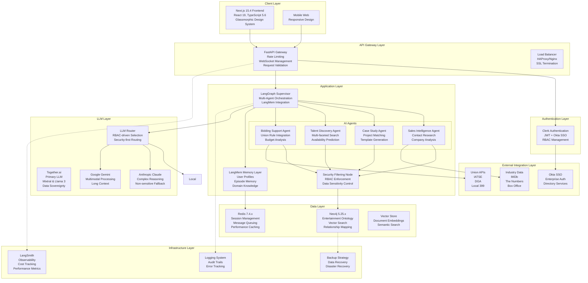
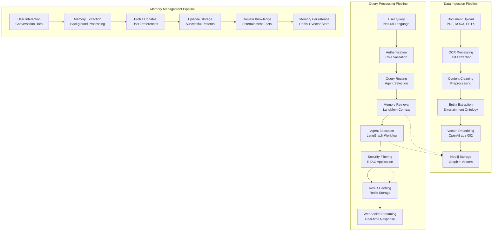
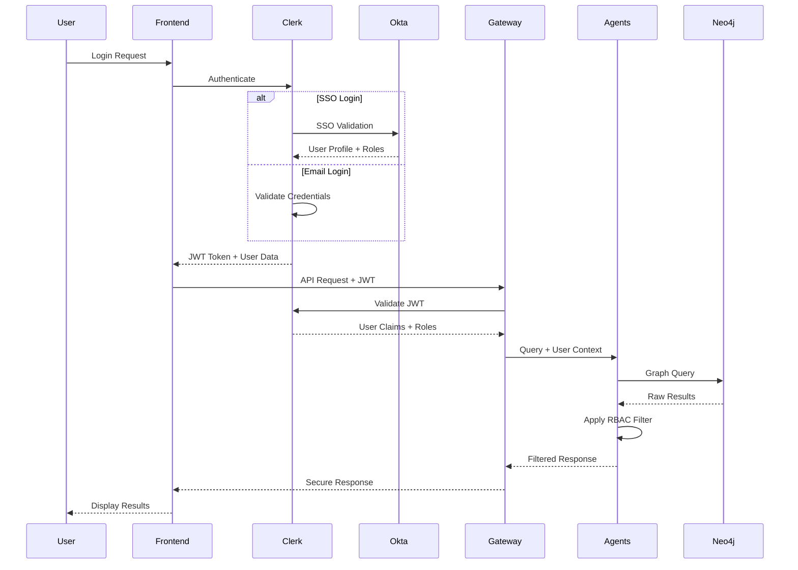

# OneVice AI-Powered Business Intelligence Hub - System Architecture

**Version:** 2.0  
**Date:** September 1, 2025  
**Status:** Architecture Design Complete  
**Prepared by:** System Architect

## 1. Executive Summary

This document defines the comprehensive system architecture for OneVice, an AI-powered business intelligence hub designed for the entertainment industry. The architecture supports 4 user roles, 6-level data sensitivity hierarchy, real-time AI agent responses, and enterprise-grade security with Clerk authentication and Okta SSO integration.

## 2. Technical Architecture Overview

### 2.1 System Architecture Diagram



### 2.2 Component Interaction Matrix

| Component | Interacts With | Protocol | Purpose |
|-----------|----------------|----------|---------|
| Next.js Frontend | FastAPI Gateway | WebSocket + REST | Real-time chat, API calls |
| FastAPI Gateway | Clerk Auth | JWT Validation | Token verification |
| LangGraph Orchestrator | AI Agents | Internal Python | Agent coordination |
| Security Filter | Neo4j | Cypher Queries | Data access control |
| LangMem Memory | Redis | Redis Protocol | Memory persistence |
| AI Agents | LLM Router | HTTP/gRPC | Model inference |
| Bidding Agent | Union APIs | REST APIs | Real-time rule validation |

## 3. Microservices Architecture

### 3.1 Service Breakdown

#### 3.1.1 Authentication Service (Clerk + Okta)
```yaml
Service: Authentication Service
Technology: Clerk + Okta SSO
Responsibilities:
  - User authentication and authorization
  - JWT token management and validation
  - Role-based access control (RBAC)
  - SSO integration with enterprise directory
  - Session management
  - Webhook processing for user events

Endpoints:
  POST /auth/login
  POST /auth/logout
  POST /auth/refresh
  GET /auth/profile
  POST /webhooks/clerk
```

#### 3.1.2 API Gateway Service
```yaml
Service: API Gateway
Technology: FastAPI 0.115.x
Responsibilities:
  - Request routing and validation
  - Rate limiting and throttling
  - WebSocket connection management
  - CORS handling
  - Request/response transformation
  - Error handling and standardization
  - Audit logging

Endpoints:
  WebSocket: /ws/{thread_id}
  POST /api/chat/message
  GET /api/health
  GET /api/metrics
```

#### 3.1.3 Agent Orchestration Service
```yaml
Service: Agent Orchestration
Technology: LangGraph 0.6.6+ + LangMem
Responsibilities:
  - Multi-agent workflow coordination
  - Memory management and retrieval
  - Agent state management
  - Query routing and load balancing
  - Response aggregation
  - Performance monitoring

Internal APIs:
  invoke_agent(agent_type, query, context)
  manage_memory(operation, namespace, data)
  filter_response(content, user_role)
```

#### 3.1.4 Knowledge Graph Service
```yaml
Service: Knowledge Graph
Technology: Neo4j 5.25.x + Vector Search
Responsibilities:
  - Graph database management
  - Entity relationship storage
  - Vector similarity search
  - Complex query execution
  - Data backup and recovery
  - Performance optimization

APIs:
  POST /graph/query
  POST /graph/vector-search
  POST /graph/batch-insert
  GET /graph/schema
```

#### 3.1.5 Memory Management Service
```yaml
Service: Memory Management
Technology: LangMem SDK + Redis
Responsibilities:
  - Conversational memory storage
  - User profile management
  - Agent episode tracking
  - Domain knowledge accumulation
  - Memory search and retrieval
  - Background memory processing

APIs:
  POST /memory/store
  GET /memory/search
  PUT /memory/update
  DELETE /memory/clean
```

### 3.2 Service Communication Patterns

#### 3.2.1 Synchronous Communication
- **Frontend ↔ Gateway**: HTTP REST + WebSocket
- **Gateway ↔ Auth**: JWT validation calls
- **Agents ↔ Knowledge Graph**: Cypher queries
- **Agents ↔ External APIs**: HTTP REST

#### 3.2.2 Asynchronous Communication
- **Memory Processing**: Background memory extraction
- **Audit Logging**: Non-blocking log persistence
- **Metrics Collection**: Background performance monitoring
- **Cache Updates**: Asynchronous cache invalidation

## 4. Database Architecture

### 4.1 Neo4j Graph Schema Design

#### 4.1.1 Entertainment Industry Ontology

```cypher
// ===============================
// CORE NODE TYPES
// ===============================

// Person nodes with role distinction
CREATE CONSTRAINT person_id FOR (p:Person) REQUIRE p.id IS UNIQUE;
CREATE INDEX person_name FOR (p:Person) ON (p.name);
CREATE INDEX person_role FOR (p:Person) ON (p.role_type);

(:Person {
    id: "uuid",
    name: "String",
    role_type: "Director" | "Creative Director" | "Talent" | "Client" | "Producer",
    specialization: ["Music Video", "Commercial", "Brand Film", "Documentary"],
    union_status: "Union" | "Non-Union" | "Unknown",
    contact_info: {
        email: "String",
        phone: "String", 
        agent: "String",
        manager: "String"
    },
    bio: "String",
    years_experience: Integer,
    location: "String",
    availability_status: "Available" | "Busy" | "Unknown",
    created_at: DateTime,
    updated_at: DateTime,
    // Vector embeddings for similarity search
    bio_embedding: [Float],
    skills_embedding: [Float]
})

// Project nodes with comprehensive metadata
CREATE CONSTRAINT project_id FOR (p:Project) REQUIRE p.id IS UNIQUE;
CREATE INDEX project_type FOR (p:Project) ON (p.type);
CREATE INDEX project_budget_tier FOR (p:Project) ON (p.budget_tier);

(:Project {
    id: "uuid",
    name: "String",
    type: "Music Video" | "Commercial" | "Brand Film" | "Documentary" | "Series",
    budget_tier: "$0-50k" | "$50k-100k" | "$100k-300k" | "$300k+",
    exact_budget: Float,  // Restricted based on user role
    union_status: "Union" | "Non-Union" | "Mixed",
    completion_date: Date,
    production_date: Date,
    status: "Completed" | "In Production" | "In Development" | "Pitched" | "Cancelled",
    duration: Integer,  // in minutes
    format: "4K" | "HD" | "Film" | "Digital",
    genre: ["Music", "Fashion", "Automotive", "Tech", "Lifestyle"],
    awards: ["String"],
    views: Integer,
    platform: ["YouTube", "TV", "Streaming", "Theatrical"],
    created_at: DateTime,
    updated_at: DateTime,
    // Vector embeddings
    concept_embedding: [Float],
    description_embedding: [Float]
})

// Organization nodes
CREATE CONSTRAINT org_id FOR (o:Organization) REQUIRE o.id IS UNIQUE;
CREATE INDEX org_type FOR (o:Organization) ON (o.type);

(:Organization {
    id: "uuid",
    name: "String",
    type: "Production Company" | "Client Brand" | "Agency" | "Union" | "Talent Agency",
    industry: "String",
    tier: "Enterprise" | "Mid-Market" | "Startup",
    location: "String",
    website: "String",
    contact_info: {...},
    annual_revenue: "String",
    employee_count: Integer,
    founded_year: Integer,
    created_at: DateTime,
    updated_at: DateTime
})

// Creative Concept nodes
CREATE CONSTRAINT concept_id FOR (c:CreativeConcept) REQUIRE c.id IS UNIQUE;

(:CreativeConcept {
    id: "uuid",
    concept: "String",
    category: "Visual Style" | "Narrative" | "Technical" | "Thematic" | "Audio",
    description: "String",
    tags: ["String"],
    inspiration_source: "String",
    difficulty_level: "Beginner" | "Intermediate" | "Expert",
    budget_impact: "Low" | "Medium" | "High",
    created_at: DateTime,
    concept_embedding: [Float]
})

// Document nodes with sensitivity classification
CREATE CONSTRAINT doc_id FOR (d:Document) REQUIRE d.id IS UNIQUE;
CREATE INDEX doc_sensitivity FOR (d:Document) ON (d.sensitivity_level);

(:Document {
    id: "uuid",
    title: "String",
    type: "Treatment" | "Pitch Deck" | "Budget" | "Contract" | "Call Sheet" | "Script",
    sensitivity_level: Integer,  // 1-6 (1=most sensitive)
    file_path: "String",
    file_type: "PDF" | "DOCX" | "PPTX" | "TXT",
    created_date: Date,
    modified_date: Date,
    word_count: Integer,
    full_text_content: "String",
    summary: "String",
    // Vector embeddings
    content_embedding: [Float],
    summary_embedding: [Float]
})

// Union nodes for labor relations
CREATE CONSTRAINT union_id FOR (u:Union) REQUIRE u.id IS UNIQUE;

(:Union {
    id: "uuid",
    name: "String",
    type: "IATSE" | "DGA" | "SAG-AFTRA" | "Local 399" | "Other",
    local_number: String,
    jurisdiction: "String",
    contract_details: {...},
    current_rates: {...},
    rules_last_updated: DateTime
})
```

#### 4.1.2 Relationship Schema

```cypher
// ===============================
// RELATIONSHIP TYPES
// ===============================

// Core project relationships
(:Person)-[:DIRECTED {
    role: "Director",
    start_date: Date,
    end_date: Date,
    compensation_tier: "String",
    performance_rating: Float
}]->(:Project)

(:Person)-[:CREATIVE_DIRECTED {
    role: "Creative Director",
    concept_contribution: ["String"],
    collaboration_level: "Lead" | "Collaborative" | "Consultant",
    start_date: Date,
    end_date: Date
}]->(:Project)

(:Person)-[:PERFORMED_IN {
    role: "String",
    character: "String",
    screen_time: Integer,
    union_contract: Boolean,
    compensation_tier: "String"
}]->(:Project)

(:Person)-[:PRODUCED {
    role: "Executive Producer" | "Producer" | "Line Producer",
    responsibilities: ["String"],
    budget_authority: Boolean
}]->(:Project)

// Organizational relationships
(:Person)-[:WORKS_FOR {
    position: "String",
    start_date: Date,
    end_date: Date,
    employment_type: "Full-time" | "Contract" | "Freelance"
}]->(:Organization)

(:Project)-[:FOR_CLIENT]->(:Organization)
(:Project)-[:PRODUCED_BY]->(:Organization)

// Creative and conceptual relationships
(:Project)-[:INCORPORATES {
    implementation_level: "Primary" | "Secondary" | "Reference",
    success_rating: Float
}]->(:CreativeConcept)

(:Document)-[:DESCRIBES]->(:Project)
(:Document)-[:MENTIONS]->(:Person)
(:Document)-[:REFERENCES]->(:Organization)

// Advanced relationship patterns
(:Person)-[:COLLABORATED_WITH {
    projects: ["uuid"],
    frequency: Integer,
    success_rate: Float,
    relationship_quality: "Excellent" | "Good" | "Fair" | "Poor"
}]->(:Person)

(:Project)-[:SIMILAR_TO {
    similarity_score: Float,
    similarity_aspects: ["Budget", "Style", "Client", "Talent", "Concept"],
    comparison_date: DateTime
}]->(:Project)

(:CreativeConcept)-[:INFLUENCES {
    influence_strength: Float,
    context: "String"
}]->(:CreativeConcept)

// Union and labor relationships
(:Person)-[:MEMBER_OF]->(:Union)
(:Project)-[:GOVERNED_BY {
    contract_type: "String",
    rate_schedule: "String",
    special_provisions: ["String"]
}]->(:Union)
```

#### 4.1.3 Vector Search Implementation

```python
# Vector index configuration for hybrid search
VECTOR_INDEXES = {
    "person_bio": {
        "node_label": "Person",
        "property": "bio_embedding",
        "dimensions": 1536,
        "similarity_function": "cosine"
    },
    "project_concept": {
        "node_label": "Project", 
        "property": "concept_embedding",
        "dimensions": 1536,
        "similarity_function": "cosine"
    },
    "document_content": {
        "node_label": "Document",
        "property": "content_embedding", 
        "dimensions": 1536,
        "similarity_function": "cosine"
    },
    "creative_concept": {
        "node_label": "CreativeConcept",
        "property": "concept_embedding",
        "dimensions": 1536,
        "similarity_function": "cosine"
    }
}

# Create vector indexes
for index_name, config in VECTOR_INDEXES.items():
    create_query = f"""
    CREATE VECTOR INDEX {index_name}
    FOR (n:{config['node_label']}) 
    ON n.{config['property']}
    OPTIONS {{
        indexConfig: {{
            `vector.dimensions`: {config['dimensions']},
            `vector.similarity_function`: '{config['similarity_function']}'
        }}
    }}
    """
```

### 4.2 Redis Caching Strategy

#### 4.2.1 Cache Architecture

```python
class RedisCacheStrategy:
    """Comprehensive caching strategy for OneVice"""
    
    def __init__(self):
        self.cache_patterns = {
            # Session Management
            "sessions": {
                "pattern": "session:{user_id}:{thread_id}",
                "ttl": 86400,  # 24 hours
                "data": "user context, conversation state"
            },
            
            # Query Results
            "queries": {
                "pattern": "query:{hash}:{role}",
                "ttl": 3600,   # 1 hour
                "data": "agent responses, filtered by role"
            },
            
            # User Profiles
            "profiles": {
                "pattern": "profile:{user_id}",
                "ttl": 7200,   # 2 hours
                "data": "user preferences, recent activity"
            },
            
            # Graph Query Results
            "graph": {
                "pattern": "graph:{query_hash}",
                "ttl": 1800,   # 30 minutes
                "data": "Neo4j query results"
            },
            
            # Vector Search Results
            "vectors": {
                "pattern": "vector:{embedding_hash}",
                "ttl": 3600,   # 1 hour
                "data": "similarity search results"
            },
            
            # Union Rules (External API)
            "union_rules": {
                "pattern": "union:{union_type}:{state}",
                "ttl": 21600,  # 6 hours
                "data": "current union rules and rates"
            },
            
            # Real-time Metrics
            "metrics": {
                "pattern": "metrics:{metric_type}:{timestamp}",
                "ttl": 300,    # 5 minutes
                "data": "performance and usage metrics"
            }
        }
    
    async def cache_query_result(
        self, 
        query: str, 
        result: str, 
        user_role: str,
        ttl: int = None
    ):
        """Cache filtered query results by role"""
        query_hash = hashlib.sha256(query.encode()).hexdigest()[:16]
        cache_key = f"query:{query_hash}:{user_role}"
        
        await self.redis.setex(
            cache_key,
            ttl or self.cache_patterns["queries"]["ttl"],
            json.dumps({
                "result": result,
                "timestamp": datetime.utcnow().isoformat(),
                "role": user_role
            })
        )
    
    async def get_cached_result(
        self, 
        query: str, 
        user_role: str
    ) -> Optional[str]:
        """Retrieve cached result if available"""
        query_hash = hashlib.sha256(query.encode()).hexdigest()[:16]
        cache_key = f"query:{query_hash}:{user_role}"
        
        cached_data = await self.redis.get(cache_key)
        if cached_data:
            data = json.loads(cached_data)
            return data["result"]
        return None
```

#### 4.2.2 Session Management

```python
class SessionManager:
    """WebSocket session management with Redis persistence"""
    
    def __init__(self, redis_client):
        self.redis = redis_client
        self.session_ttl = 86400  # 24 hours
    
    async def create_session(
        self,
        user_id: str,
        thread_id: str,
        user_role: str,
        connection_id: str
    ):
        """Create persistent session state"""
        session_data = {
            "user_id": user_id,
            "thread_id": thread_id,
            "role": user_role,
            "connection_id": connection_id,
            "created_at": datetime.utcnow().isoformat(),
            "last_activity": datetime.utcnow().isoformat(),
            "message_count": 0,
            "active_agents": [],
            "context": {}
        }
        
        session_key = f"session:{user_id}:{thread_id}"
        await self.redis.setex(
            session_key,
            self.session_ttl,
            json.dumps(session_data)
        )
        
        # Track active connections
        await self.redis.sadd(f"active_users:{user_id}", thread_id)
        await self.redis.expire(f"active_users:{user_id}", self.session_ttl)
    
    async def update_session_activity(
        self,
        user_id: str,
        thread_id: str,
        activity_data: Dict
    ):
        """Update session with latest activity"""
        session_key = f"session:{user_id}:{thread_id}"
        session_data = await self.get_session(user_id, thread_id)
        
        if session_data:
            session_data.update({
                "last_activity": datetime.utcnow().isoformat(),
                "message_count": session_data.get("message_count", 0) + 1,
                **activity_data
            })
            
            await self.redis.setex(
                session_key,
                self.session_ttl,
                json.dumps(session_data)
            )
```

### 4.3 Data Flow Architecture



## 5. Security Architecture

### 5.1 Authentication & Authorization Flow



### 5.2 Role-Based Access Control (RBAC)

#### 5.2.1 Data Sensitivity Hierarchy

```python
class DataSensitivityLevels:
    """6-level data sensitivity hierarchy (1=most sensitive)"""
    
    EXACT_BUDGETS = 1       # Precise financial amounts
    CONTRACTS = 2           # Contract terms, negotiations, rates
    INTERNAL_STRATEGY = 3   # Strategic plans, internal notes
    CALL_SHEETS = 4         # Production schedules, contact details
    SCRIPTS = 5             # Creative content, treatments
    SALES_MATERIALS = 6     # Public-facing presentations
    
    ROLE_ACCESS_MATRIX = {
        "Leadership": [1, 2, 3, 4, 5, 6],      # Full access
        "Director": [2, 3, 4, 5, 6],           # No exact budgets
        "Salesperson": [4, 5, 6],              # Public + operational data
        "Creative Director": [4, 5, 6]         # Creative + operational data
    }
    
    @classmethod
    def can_access(cls, user_role: str, sensitivity_level: int) -> bool:
        """Check if user role can access data at sensitivity level"""
        allowed_levels = cls.ROLE_ACCESS_MATRIX.get(user_role, [])
        return sensitivity_level in allowed_levels
    
    @classmethod
    def filter_by_role(cls, data: Dict, user_role: str) -> Dict:
        """Filter data based on role permissions"""
        filtered_data = {}
        
        for key, value in data.items():
            item_sensitivity = cls.get_item_sensitivity(key, value)
            if cls.can_access(user_role, item_sensitivity):
                if user_role in ["Salesperson", "Creative Director"] and "budget" in key:
                    # Convert exact amounts to ranges
                    filtered_data[key] = cls.convert_to_budget_range(value)
                else:
                    filtered_data[key] = value
        
        return filtered_data
```

#### 5.2.2 Security Filtering Node Implementation

```python
class SecurityFilteringNode:
    """LangGraph node for enforcing RBAC on AI responses"""
    
    def __init__(self):
        self.sensitivity_classifier = SensitivityClassifier()
        self.budget_converter = BudgetRangeConverter()
        self.pii_scrubber = PIIScrubber()
    
    async def __call__(self, state: AgentState) -> AgentState:
        """Apply security filtering based on user role"""
        
        user_role = state["role"]
        user_id = state["user_id"]
        raw_response = state.get("response", "")
        
        # 1. Classify content sensitivity
        content_sensitivity = await self.sensitivity_classifier.classify(raw_response)
        
        # 2. Apply role-based filtering
        if user_role == "Leadership":
            filtered_response = raw_response  # Full access
            
        elif user_role == "Director":
            # Project-specific filtering
            filtered_response = await self.filter_by_project_access(
                raw_response, user_id
            )
            # Remove exact budget amounts
            filtered_response = self.budget_converter.exact_to_ranges(
                filtered_response
            )
            
        elif user_role in ["Salesperson", "Creative Director"]:
            # Most restrictive filtering
            filtered_response = await self.apply_restrictive_filter(
                raw_response, content_sensitivity
            )
            # Convert all budget data to ranges
            filtered_response = self.budget_converter.exact_to_ranges(
                filtered_response
            )
            # Remove internal strategy content
            filtered_response = self.remove_internal_content(filtered_response)
        
        # 3. Scrub any remaining PII
        filtered_response = await self.pii_scrubber.scrub(filtered_response)
        
        # 4. Log access for audit
        await self.log_access_event(user_id, user_role, content_sensitivity)
        
        return {
            **state,
            "response": filtered_response,
            "security_applied": True,
            "original_sensitivity": content_sensitivity
        }
    
    async def filter_by_project_access(
        self, 
        response: str, 
        user_id: str
    ) -> str:
        """Filter content based on user's project assignments"""
        
        # Get user's assigned projects
        user_projects = await self.get_user_project_assignments(user_id)
        
        # Extract project references from response
        mentioned_projects = await self.extract_project_references(response)
        
        # Filter out projects user doesn't have access to
        accessible_projects = set(user_projects) & set(mentioned_projects)
        
        if not accessible_projects:
            return "You don't have access to the projects mentioned in this query."
        
        # Filter response to only include accessible project data
        return await self.filter_project_content(response, accessible_projects)
```

### 5.3 Data Protection Implementation

#### 5.3.1 Encryption Strategy

```python
class DataProtectionLayer:
    """Comprehensive data protection for OneVice"""
    
    def __init__(self):
        self.encryption_key = os.getenv("ENCRYPTION_KEY")
        self.cipher_suite = Fernet(self.encryption_key)
    
    async def encrypt_sensitive_data(self, data: Dict) -> Dict:
        """Encrypt sensitive fields before storage"""
        sensitive_fields = [
            "exact_budget", "contact_info", "contract_details",
            "compensation_tier", "personal_notes"
        ]
        
        encrypted_data = data.copy()
        
        for field in sensitive_fields:
            if field in data and data[field]:
                encrypted_value = self.cipher_suite.encrypt(
                    json.dumps(data[field]).encode()
                )
                encrypted_data[field] = encrypted_value.decode()
        
        return encrypted_data
    
    async def decrypt_for_authorized_user(
        self, 
        data: Dict, 
        user_role: str
    ) -> Dict:
        """Decrypt data based on user authorization level"""
        
        if not DataSensitivityLevels.can_access(user_role, 1):
            # Remove encrypted fields for unauthorized users
            return {k: v for k, v in data.items() 
                   if not k.startswith("encrypted_")}
        
        # Decrypt for authorized users
        decrypted_data = data.copy()
        for key, value in data.items():
            if key.startswith("encrypted_") and value:
                try:
                    decrypted_value = self.cipher_suite.decrypt(value.encode())
                    original_key = key.replace("encrypted_", "")
                    decrypted_data[original_key] = json.loads(decrypted_value.decode())
                except Exception as e:
                    logger.error(f"Decryption failed for {key}: {e}")
        
        return decrypted_data
```

## 6. Integration Architecture

### 6.1 LangGraph Multi-Agent Orchestration

#### 6.1.1 Supervisor Pattern Implementation

```python
from langgraph.graph import StateGraph, START, END
from langgraph.prebuilt import create_react_agent
from langmem import create_memory_manager

class OneViceOrchestrator:
    """Main orchestrator for OneVice AI agents"""
    
    def __init__(self):
        self.graph = self.create_supervisor_graph()
        self.memory_manager = create_memory_manager(
            "anthropic:claude-3-5-sonnet-latest",
            namespace=("onevice", "main")
        )
    
    def create_supervisor_graph(self) -> StateGraph:
        """Create LangGraph workflow with supervisor pattern"""
        
        # Define workflow
        workflow = StateGraph(AgentState)
        
        # Add agent nodes
        workflow.add_node("supervisor", self.supervisor_node)
        workflow.add_node("sales_intelligence", self.create_sales_agent())
        workflow.add_node("case_study", self.create_case_study_agent())
        workflow.add_node("talent_discovery", self.create_talent_agent())
        workflow.add_node("bidding_support", self.create_bidding_agent())
        workflow.add_node("security_filter", SecurityFilteringNode())
        workflow.add_node("memory_manager", self.memory_node)
        
        # Define routing logic
        workflow.add_edge(START, "supervisor")
        workflow.add_conditional_edges(
            "supervisor",
            self.route_to_agent,
            {
                "sales_intelligence": "sales_intelligence",
                "case_study": "case_study", 
                "talent_discovery": "talent_discovery",
                "bidding_support": "bidding_support",
                "end": "security_filter"
            }
        )
        
        # All agents flow through security filter
        for agent in ["sales_intelligence", "case_study", "talent_discovery", "bidding_support"]:
            workflow.add_edge(agent, "security_filter")
        
        # Security filter to memory manager to end
        workflow.add_edge("security_filter", "memory_manager")
        workflow.add_edge("memory_manager", END)
        
        return workflow.compile()
    
    async def supervisor_node(self, state: AgentState) -> AgentState:
        """Supervisor node for query routing and agent selection"""
        
        query = state["messages"][-1].content
        user_role = state["role"]
        
        # Analyze query to determine best agent
        agent_selection = await self.analyze_query_for_routing(query, user_role)
        
        # Add routing context
        return {
            **state,
            "next_agent": agent_selection["agent"],
            "query_type": agent_selection["type"],
            "confidence": agent_selection["confidence"],
            "routing_context": agent_selection["context"]
        }
    
    async def analyze_query_for_routing(
        self, 
        query: str, 
        user_role: str
    ) -> Dict:
        """Intelligent query routing based on content and user role"""
        
        # Extract query intent and entities
        entities = await extract_entities(query)
        intent = await classify_intent(query)
        
        routing_logic = {
            # Sales-related queries
            ("research", "contact", "company", "client"): {
                "agent": "sales_intelligence",
                "type": "sales_research"
            },
            
            # Project similarity and case studies
            ("similar", "example", "case study", "pitch", "portfolio"): {
                "agent": "case_study", 
                "type": "case_compilation"
            },
            
            # Talent and crew searches
            ("director", "talent", "crew", "cast", "find", "available"): {
                "agent": "talent_discovery",
                "type": "talent_search"
            },
            
            # Bidding and union queries
            ("bid", "budget", "union", "rate", "cost", "proposal"): {
                "agent": "bidding_support",
                "type": "bidding_analysis"
            }
        }
        
        # Score each agent based on query content
        scores = {}
        for keywords, config in routing_logic.items():
            score = sum(1 for keyword in keywords if keyword.lower() in query.lower())
            scores[config["agent"]] = score
        
        # Select highest scoring agent
        best_agent = max(scores.items(), key=lambda x: x[1])
        
        return {
            "agent": best_agent[0],
            "type": routing_logic[next(k for k, v in routing_logic.items() 
                                      if v["agent"] == best_agent[0])]["type"],
            "confidence": min(best_agent[1] / 3.0, 1.0),
            "context": {
                "entities": entities,
                "intent": intent,
                "scores": scores
            }
        }
```

#### 6.1.2 Agent Implementations

```python
class SalesIntelligenceAgent:
    """Sales research and client intelligence agent"""
    
    def __init__(self):
        self.tools = [
            neo4j_query_tool,
            company_research_tool,
            contact_enrichment_tool,
            memory_tools["search_user_profiles"],
            memory_tools["manage_agent_episodes"]
        ]
    
    async def __call__(self, state: AgentState) -> AgentState:
        """Execute sales intelligence workflow"""
        
        query = state["messages"][-1].content
        user_context = {
            "user_id": state["user_id"],
            "role": state["role"]
        }
        
        # 1. Extract entities (people, companies)
        entities = await self.extract_sales_entities(query)
        
        # 2. Search for existing relationships
        relationships = await self.find_existing_relationships(entities)
        
        # 3. Enrich with external data
        enriched_data = await self.enrich_contact_data(entities)
        
        # 4. Analyze project history
        project_history = await self.analyze_project_history(entities)
        
        # 5. Generate sales brief
        sales_brief = await self.generate_sales_brief({
            "entities": entities,
            "relationships": relationships,
            "enriched_data": enriched_data,
            "project_history": project_history
        })
        
        return {
            **state,
            "response": sales_brief,
            "processed_entities": entities,
            "confidence_scores": {"sales_intelligence": 0.9}
        }

class TalentDiscoveryAgent:
    """Advanced talent search and discovery agent"""
    
    async def __call__(self, state: AgentState) -> AgentState:
        """Execute talent discovery workflow"""
        
        query = state["messages"][-1].content
        
        # 1. Parse search criteria
        search_criteria = await self.parse_talent_criteria(query)
        
        # 2. Multi-faceted graph search
        talent_results = await self.execute_talent_search(search_criteria)
        
        # 3. Apply availability filtering
        available_talent = await self.filter_by_availability(talent_results)
        
        # 4. Score and rank results
        ranked_results = await self.rank_talent_results(
            available_talent, 
            search_criteria
        )
        
        # 5. Generate talent profiles
        talent_profiles = await self.generate_talent_profiles(ranked_results)
        
        return {
            **state,
            "response": talent_profiles,
            "processed_entities": [t["id"] for t in ranked_results],
            "confidence_scores": {"talent_discovery": 0.85}
        }
    
    async def execute_talent_search(self, criteria: Dict) -> List[Dict]:
        """Complex Cypher query for talent discovery"""
        
        cypher_query = """
        MATCH (p:Person)
        WHERE p.role_type IN $role_types
        AND p.union_status IN $union_preferences
        AND p.availability_status = 'Available'
        
        // Specialization matching
        WITH p, [spec IN p.specialization WHERE spec IN $specializations] as matched_specs
        WHERE size(matched_specs) > 0
        
        // Find collaboration history
        OPTIONAL MATCH (p)-[collab:COLLABORATED_WITH]-(other:Person)
        WHERE other.name IN $preferred_collaborators
        
        // Find project history in similar budget tier
        OPTIONAL MATCH (p)-[:DIRECTED|CREATIVE_DIRECTED|PERFORMED_IN]-(proj:Project)
        WHERE proj.budget_tier IN $budget_tiers
        
        RETURN p, 
               matched_specs,
               collect(DISTINCT other.name) as collaborators,
               collect(DISTINCT proj.name) as recent_projects,
               size(matched_specs) as specialization_score,
               count(collab) as collaboration_score
        ORDER BY specialization_score DESC, collaboration_score DESC
        LIMIT $limit
        """
        
        return await self.neo4j_client.run_query(cypher_query, criteria)

class BiddingSupportAgent:
    """Union rule integration and bidding analysis agent"""
    
    def __init__(self):
        self.union_clients = {
            "IATSE": IATSEAPIClient(),
            "DGA": DGAAPIClient(), 
            "SAG_AFTRA": SAGAFTRAAPIClient(),
            "LOCAL_399": Local399APIClient()
        }
    
    async def __call__(self, state: AgentState) -> AgentState:
        """Execute bidding support workflow"""
        
        query = state["messages"][-1].content
        
        # 1. Extract bidding requirements
        bid_requirements = await self.extract_bid_requirements(query)
        
        # 2. Fetch current union rules
        union_rules = await self.get_current_union_rules(bid_requirements)
        
        # 3. Calculate base costs
        cost_breakdown = await self.calculate_union_costs(
            bid_requirements, union_rules
        )
        
        # 4. Risk assessment
        risk_analysis = await self.assess_project_risks(bid_requirements)
        
        # 5. Generate bid recommendation
        bid_recommendation = await self.generate_bid_proposal({
            "requirements": bid_requirements,
            "union_rules": union_rules,
            "costs": cost_breakdown,
            "risks": risk_analysis
        })
        
        return {
            **state,
            "response": bid_recommendation,
            "confidence_scores": {"bidding_support": 0.88}
        }
    
    async def get_current_union_rules(self, requirements: Dict) -> Dict:
        """Fetch real-time union rules and rates"""
        
        location = requirements.get("location", "Los Angeles")
        project_type = requirements.get("type", "Music Video")
        
        union_rules = {}
        
        for union_name, client in self.union_clients.items():
            try:
                # Check cache first
                cache_key = f"union:{union_name}:{location}:{project_type}"
                cached_rules = await self.redis.get(cache_key)
                
                if cached_rules:
                    union_rules[union_name] = json.loads(cached_rules)
                else:
                    # Fetch from API
                    rules = await client.get_current_rules(location, project_type)
                    union_rules[union_name] = rules
                    
                    # Cache for 6 hours
                    await self.redis.setex(cache_key, 21600, json.dumps(rules))
                    
            except Exception as e:
                logger.error(f"Failed to fetch {union_name} rules: {e}")
                # Fallback to cached rules
                union_rules[union_name] = await self.get_fallback_rules(
                    union_name, location
                )
        
        return union_rules
```

### 6.2 LangMem Memory Management Integration

#### 6.2.1 Memory Architecture

```python
class OneViceMemoryManager:
    """Comprehensive memory management for OneVice"""
    
    def __init__(self):
        self.memory_managers = {
            "user_profiles": create_memory_manager(
                "anthropic:claude-3-5-sonnet-latest",
                schemas=[UserProfile],
                namespace=("profiles", "{user_id}"),
                instructions="Extract and maintain user preferences, role information, and interaction patterns"
            ),
            
            "agent_episodes": create_memory_manager(
                "anthropic:claude-3-5-sonnet-latest", 
                schemas=[SuccessfulInteraction],
                namespace=("episodes", "{agent_type}"),
                instructions="Capture successful agent interactions for learning and improvement"
            ),
            
            "domain_knowledge": create_memory_manager(
                "anthropic:claude-3-5-sonnet-latest",
                schemas=[EntertainmentKnowledge],
                namespace=("knowledge", "entertainment"),
                instructions="Extract and organize entertainment industry knowledge and best practices"
            ),
            
            "project_context": create_memory_manager(
                "anthropic:claude-3-5-sonnet-latest",
                schemas=[ProjectContext],
                namespace=("projects", "{project_id}"),
                instructions="Maintain project-specific context and learnings"
            )
        }
    
    async def enhance_query_with_memory(
        self,
        query: str,
        user_context: Dict
    ) -> str:
        """Enhance user query with relevant memory context"""
        
        user_id = user_context["user_id"]
        
        # Retrieve user profile memories
        profile_memories = await self.memory_managers["user_profiles"].search(
            query=query,
            namespace=("profiles", user_id),
            limit=3
        )
        
        # Get relevant domain knowledge
        domain_memories = await self.memory_managers["domain_knowledge"].search(
            query=query,
            namespace=("knowledge", "entertainment"),
            limit=5
        )
        
        # Construct enhanced query
        enhanced_query = f"""
        Original Query: {query}
        
        User Context:
        - Role: {user_context.get('role')}
        - Previous interactions: {[m.value for m in profile_memories]}
        
        Relevant Entertainment Knowledge:
        {[m.value for m in domain_memories]}
        
        Please provide a response that takes into account this context.
        """
        
        return enhanced_query
    
    async def store_interaction_memory(
        self,
        interaction_data: Dict,
        user_context: Dict
    ):
        """Store successful interactions for future learning"""
        
        # Store in user profile
        await self.memory_managers["user_profiles"].store(
            data=interaction_data,
            namespace=("profiles", user_context["user_id"])
        )
        
        # Store as agent episode if successful
        if interaction_data.get("success_score", 0) > 0.8:
            await self.memory_managers["agent_episodes"].store(
                data=interaction_data,
                namespace=("episodes", interaction_data["agent_type"])
            )
```

#### 6.2.2 Memory Schema Definitions

```python
from pydantic import BaseModel
from datetime import datetime
from typing import List, Dict, Any, Optional

class UserProfile(BaseModel):
    """User profile schema for personalized interactions"""
    user_id: str
    name: str
    role: str  # Leadership, Director, Salesperson, Creative Director
    email: str
    preferences: Dict[str, Any]
    project_access: List[str]  # Project IDs user has access to
    communication_style: str  # concise, detailed, technical, visual
    expertise_areas: List[str]
    recent_queries: List[str]
    interaction_history: List[Dict]
    created_at: datetime
    updated_at: datetime

class SuccessfulInteraction(BaseModel):
    """Capture successful agent interactions for learning"""
    agent_type: str  # sales_intel, case_study, talent_discovery, bidding
    query_pattern: str
    solution_approach: str
    outcome_quality: float  # 0.0 to 1.0
    user_satisfaction: str  # excellent, good, fair, poor
    context_factors: List[str]
    lessons_learned: str
    execution_time: float
    token_usage: int
    timestamp: datetime

class EntertainmentKnowledge(BaseModel):
    """Domain-specific entertainment industry knowledge"""
    concept: str
    category: str  # union_rules, budget_practices, talent_info, industry_trends
    description: str
    source: str
    confidence: float
    last_updated: datetime
    related_concepts: List[str]
    geographic_scope: str  # global, US, CA, NY, etc.
    temporal_relevance: str  # current, historical, seasonal

class ProjectContext(BaseModel):
    """Project-specific context and learnings"""
    project_id: str
    project_name: str
    key_personnel: List[str]
    budget_tier: str
    lessons_learned: List[str]
    successful_strategies: List[str]
    challenges_faced: List[str]
    client_preferences: Dict[str, Any]
    timeline_insights: Dict[str, Any]
```

### 6.3 WebSocket Real-Time Communication

#### 6.3.1 WebSocket Architecture

```python
class WebSocketManager:
    """Comprehensive WebSocket management for real-time communication"""
    
    def __init__(self):
        self.connections: Dict[str, WebSocketConnection] = {}
        self.user_sessions: Dict[str, Set[str]] = {}
        self.message_queue = asyncio.Queue()
        self.connection_pool = ConnectionPool()
    
    async def handle_connection(
        self,
        websocket: WebSocket,
        user_id: str,
        role: str,
        thread_id: str
    ):
        """Handle new WebSocket connection with full setup"""
        
        try:
            # Validate user and thread
            await self.validate_connection_request(user_id, role, thread_id)
            
            # Accept connection
            await websocket.accept()
            
            # Create connection object
            connection = WebSocketConnection(
                websocket=websocket,
                user_id=user_id,
                role=role,
                thread_id=thread_id,
                connected_at=datetime.utcnow()
            )
            
            connection_id = f"{user_id}:{thread_id}"
            self.connections[connection_id] = connection
            
            # Track user sessions
            if user_id not in self.user_sessions:
                self.user_sessions[user_id] = set()
            self.user_sessions[user_id].add(thread_id)
            
            # Initialize LangGraph streaming
            streaming_service = LangGraphStreamingService(user_id, role)
            
            # Start message processing loop
            await self.process_messages(connection, streaming_service)
            
        except Exception as e:
            logger.error(f"WebSocket connection failed: {e}")
            await websocket.close(code=1011, reason=str(e))
    
    async def process_messages(
        self,
        connection: WebSocketConnection,
        streaming_service: LangGraphStreamingService
    ):
        """Process incoming messages with streaming responses"""
        
        try:
            while True:
                # Wait for message
                message = await connection.websocket.receive_json()
                
                # Validate message format
                if not self.validate_message(message):
                    await connection.send_error("Invalid message format")
                    continue
                
                # Process with LangGraph streaming
                async for chunk in streaming_service.process_message_stream(
                    content=message["content"],
                    message_type=message.get("type", "chat")
                ):
                    # Send stream chunk
                    await connection.websocket.send_json({
                        "type": "stream_chunk",
                        "content": chunk.content,
                        "metadata": chunk.metadata,
                        "timestamp": datetime.utcnow().isoformat()
                    })
                
                # Send completion signal
                await connection.websocket.send_json({
                    "type": "stream_complete",
                    "timestamp": datetime.utcnow().isoformat()
                })
                
        except WebSocketDisconnect:
            await self.handle_disconnect(connection)
        except Exception as e:
            logger.error(f"Message processing error: {e}")
            await connection.send_error(str(e))

class LangGraphStreamingService:
    """LangGraph integration with WebSocket streaming"""
    
    def __init__(self, user_id: str, role: str):
        self.user_id = user_id
        self.role = role
        self.orchestrator = OneViceOrchestrator()
        self.rbac_filter = SecurityFilteringNode()
    
    async def process_message_stream(
        self,
        content: str,
        message_type: str
    ) -> AsyncIterator[StreamChunk]:
        """Stream LangGraph agent responses with RBAC filtering"""
        
        # Prepare agent state
        agent_state = {
            "messages": [{"role": "user", "content": content}],
            "user_id": self.user_id,
            "role": self.role,
            "query_type": message_type,
            "context": {},
            "security_level": self.determine_security_level(content)
        }
        
        # Configure LangGraph execution
        config = {
            "configurable": {
                "thread_id": f"{self.user_id}:thread",
                "user_id": self.user_id,
                "role": self.role,
                "stream_mode": "values"
            }
        }
        
        # Stream agent execution
        async for chunk in self.orchestrator.graph.astream(agent_state, config):
            if "response" in chunk:
                # Apply RBAC filtering to response
                filtered_chunk = await self.rbac_filter(chunk)
                
                if filtered_chunk.get("response"):
                    yield StreamChunk(
                        content=filtered_chunk["response"],
                        metadata={
                            "agent": chunk.get("current_agent"),
                            "confidence": chunk.get("confidence_scores", {}),
                            "entities": chunk.get("processed_entities", []),
                            "timestamp": datetime.utcnow().isoformat()
                        }
                    )
```

## 7. API Design Patterns

### 7.1 RESTful API Specification

```yaml
openapi: 3.0.3
info:
  title: OneVice API
  version: 2.0.0
  description: AI-Powered Business Intelligence Hub API

servers:
  - url: https://api.onevice.com/v2
    description: Production server
  - url: http://localhost:8000/v2
    description: Development server

paths:
  /auth/session:
    get:
      summary: Get current user session
      security:
        - ClerkJWT: []
      responses:
        '200':
          description: Current session info
          content:
            application/json:
              schema:
                $ref: '#/components/schemas/UserSession'
  
  /chat/threads:
    post:
      summary: Create new chat thread
      security:
        - ClerkJWT: []
      requestBody:
        required: true
        content:
          application/json:
            schema:
              type: object
              properties:
                title:
                  type: string
                type:
                  type: string
                  enum: [sales_intelligence, case_study, talent_discovery, bidding]
      responses:
        '201':
          description: Thread created
          content:
            application/json:
              schema:
                $ref: '#/components/schemas/ChatThread'
  
  /chat/threads/{thread_id}/messages:
    post:
      summary: Send message to thread
      security:
        - ClerkJWT: []
      parameters:
        - name: thread_id
          in: path
          required: true
          schema:
            type: string
      requestBody:
        required: true
        content:
          application/json:
            schema:
              $ref: '#/components/schemas/ChatMessage'
      responses:
        '200':
          description: Message processed
          content:
            application/json:
              schema:
                $ref: '#/components/schemas/MessageResponse'

  /graph/search:
    post:
      summary: Search knowledge graph
      security:
        - ClerkJWT: []
      requestBody:
        required: true
        content:
          application/json:
            schema:
              type: object
              properties:
                query:
                  type: string
                filters:
                  type: object
                limit:
                  type: integer
                  default: 10
      responses:
        '200':
          description: Search results
          content:
            application/json:
              schema:
                $ref: '#/components/schemas/SearchResults'

components:
  securitySchemes:
    ClerkJWT:
      type: http
      scheme: bearer
      bearerFormat: JWT
  
  schemas:
    UserSession:
      type: object
      properties:
        user_id:
          type: string
        role:
          type: string
          enum: [Leadership, Director, Salesperson, Creative Director]
        permissions:
          type: array
          items:
            type: string
        last_activity:
          type: string
          format: date-time
    
    ChatThread:
      type: object
      properties:
        id:
          type: string
        title:
          type: string
        type:
          type: string
        created_at:
          type: string
          format: date-time
        message_count:
          type: integer
    
    ChatMessage:
      type: object
      properties:
        content:
          type: string
        type:
          type: string
          default: "user"
        metadata:
          type: object
    
    MessageResponse:
      type: object
      properties:
        id:
          type: string
        content:
          type: string
        agent:
          type: string
        confidence:
          type: number
        entities:
          type: array
          items:
            type: object
        timestamp:
          type: string
          format: date-time
    
    SearchResults:
      type: object
      properties:
        results:
          type: array
          items:
            type: object
        total:
          type: integer
        page:
          type: integer
        limit:
          type: integer
```

### 7.2 WebSocket Protocol Specification

```typescript
// WebSocket message types for OneVice
interface WebSocketMessage {
  type: 'chat' | 'stream_chunk' | 'stream_complete' | 'error' | 'ping' | 'pong';
  id?: string;
  content?: string;
  metadata?: Record<string, any>;
  timestamp: string;
}

interface ChatMessage extends WebSocketMessage {
  type: 'chat';
  content: string;
  thread_id: string;
  message_type?: 'sales_intelligence' | 'case_study' | 'talent_discovery' | 'bidding';
}

interface StreamChunk extends WebSocketMessage {
  type: 'stream_chunk';
  content: string;
  metadata: {
    agent?: string;
    confidence?: Record<string, number>;
    entities?: string[];
    chunk_index?: number;
    total_chunks?: number;
  };
}

interface StreamComplete extends WebSocketMessage {
  type: 'stream_complete';
  metadata: {
    total_tokens: number;
    processing_time: number;
    agents_used: string[];
    confidence_scores: Record<string, number>;
  };
}

interface ErrorMessage extends WebSocketMessage {
  type: 'error';
  content: string;
  error_code?: string;
  metadata: {
    retry_after?: number;
    error_type: 'authentication' | 'rate_limit' | 'internal' | 'validation';
  };
}
```

## 8. Scalability and Performance Architecture

### 8.1 Horizontal Scaling Strategy

#### 8.1.1 Application Tier Scaling

```python
class ScalingConfiguration:
    """Scaling configuration for OneVice components"""
    
    SCALING_RULES = {
        "frontend": {
            "type": "stateless",
            "scaling_metric": "cpu_utilization",
            "target_threshold": 70,
            "min_replicas": 2,
            "max_replicas": 10,
            "scale_up_cooldown": 300,
            "scale_down_cooldown": 600
        },
        
        "api_gateway": {
            "type": "stateless", 
            "scaling_metric": "request_rate",
            "target_threshold": 1000,  # requests per minute
            "min_replicas": 3,
            "max_replicas": 15,
            "scale_up_cooldown": 180,
            "scale_down_cooldown": 300
        },
        
        "agent_orchestrator": {
            "type": "stateful",
            "scaling_metric": "active_agents",
            "target_threshold": 50,  # concurrent agent executions
            "min_replicas": 2,
            "max_replicas": 8,
            "session_affinity": True,
            "scale_up_cooldown": 120,
            "scale_down_cooldown": 600
        },
        
        "memory_service": {
            "type": "stateful",
            "scaling_metric": "memory_operations",
            "target_threshold": 100,  # operations per second
            "min_replicas": 2,
            "max_replicas": 6,
            "data_partitioning": "user_id_hash"
        }
    }

class LoadBalancingStrategy:
    """Advanced load balancing for OneVice services"""
    
    def __init__(self):
        self.strategies = {
            "frontend": "round_robin",
            "api_gateway": "least_connections", 
            "agent_orchestrator": "consistent_hashing",  # Session affinity
            "websocket": "sticky_sessions",
            "neo4j": "read_write_split"
        }
    
    async def route_websocket_connection(self, user_id: str) -> str:
        """Route WebSocket to optimal server instance"""
        
        # Use consistent hashing for session affinity
        server_hash = hash(user_id) % len(self.websocket_servers)
        primary_server = self.websocket_servers[server_hash]
        
        # Health check
        if await self.check_server_health(primary_server):
            return primary_server
        
        # Fallback to healthy server
        for server in self.websocket_servers:
            if await self.check_server_health(server):
                return server
        
        raise Exception("No healthy WebSocket servers available")
```

#### 8.1.2 Database Scaling

```python
class Neo4jScalingStrategy:
    """Neo4j clustering and read replica configuration"""
    
    def __init__(self):
        self.cluster_config = {
            "core_servers": 3,  # Write operations
            "read_replicas": 5,  # Read operations
            "load_balancing": "least_connections",
            "failover_timeout": 30,
            "backup_frequency": "daily"
        }
    
    async def route_query(self, query: str, user_role: str) -> str:
        """Route queries based on operation type and user role"""
        
        query_type = self.classify_query_type(query)
        
        if query_type == "write":
            # Write operations go to core cluster
            return await self.get_core_server()
        
        elif query_type == "read":
            # Read operations can use replicas
            if user_role in ["Salesperson", "Creative Director"]:
                # Non-sensitive queries can use any replica
                return await self.get_read_replica()
            else:
                # Sensitive queries prefer core servers
                return await self.get_core_server()
        
        elif query_type == "vector_search":
            # Vector searches to specialized nodes
            return await self.get_vector_server()

class RedisClusterStrategy:
    """Redis clustering for session and cache management"""
    
    def __init__(self):
        self.cluster_nodes = {
            "sessions": ["redis-session-1", "redis-session-2", "redis-session-3"],
            "cache": ["redis-cache-1", "redis-cache-2"],
            "queues": ["redis-queue-1", "redis-queue-2"]
        }
    
    async def get_redis_client(self, operation_type: str):
        """Get appropriate Redis client based on operation"""
        
        if operation_type == "session":
            return RedisCluster(startup_nodes=self.cluster_nodes["sessions"])
        elif operation_type == "cache":
            return RedisCluster(startup_nodes=self.cluster_nodes["cache"])
        elif operation_type == "queue":
            return RedisCluster(startup_nodes=self.cluster_nodes["queues"])
```

### 8.2 Performance Optimization

#### 8.2.1 Caching Strategy

```python
class PerformanceOptimizer:
    """Multi-layer caching and performance optimization"""
    
    def __init__(self):
        self.cache_layers = {
            "browser": {
                "static_assets": 31536000,  # 1 year
                "api_responses": 300,       # 5 minutes
                "user_preferences": 3600    # 1 hour
            },
            
            "cdn": {
                "images": 31536000,         # 1 year
                "documents": 86400,         # 1 day
                "api_responses": 3600       # 1 hour
            },
            
            "application": {
                "graph_queries": 1800,      # 30 minutes
                "vector_searches": 3600,    # 1 hour
                "user_sessions": 86400,     # 24 hours
                "union_rules": 21600        # 6 hours
            },
            
            "database": {
                "query_plans": 86400,       # 1 day
                "indexes": "persistent",
                "connection_pools": "persistent"
            }
        }
    
    async def optimize_query_execution(self, query: str, context: Dict) -> Dict:
        """Optimize query execution with intelligent caching"""
        
        # Generate query signature for caching
        query_signature = self.generate_query_signature(query, context)
        
        # Check cache layers
        cached_result = await self.check_cache_layers(query_signature)
        if cached_result:
            return {
                "result": cached_result,
                "cache_hit": True,
                "source": "cache"
            }
        
        # Execute query with performance monitoring
        start_time = time.time()
        
        try:
            result = await self.execute_optimized_query(query, context)
            
            execution_time = time.time() - start_time
            
            # Cache result if execution was successful and fast enough
            if execution_time < 5.0:  # Cache results under 5 seconds
                await self.cache_result(query_signature, result)
            
            return {
                "result": result,
                "cache_hit": False,
                "execution_time": execution_time,
                "source": "live"
            }
            
        except Exception as e:
            # Log performance issue
            logger.error(f"Query optimization failed: {e}")
            raise
```

#### 8.2.2 Connection Pooling

```python
class ConnectionPoolManager:
    """Manage database and external service connections"""
    
    def __init__(self):
        self.pools = {
            "neo4j": {
                "min_connections": 5,
                "max_connections": 50,
                "connection_timeout": 30,
                "max_transaction_retry_time": 15
            },
            
            "redis": {
                "min_connections": 10,
                "max_connections": 100,
                "connection_timeout": 5,
                "retry_on_timeout": True
            },
            
            "external_apis": {
                "min_connections": 2,
                "max_connections": 20,
                "connection_timeout": 10,
                "retry_attempts": 3
            }
        }
    
    async def get_optimized_connection(self, service: str):
        """Get optimized connection based on current load"""
        
        pool_config = self.pools[service]
        current_load = await self.measure_current_load(service)
        
        if current_load > 0.8:  # High load
            # Increase connection timeout
            timeout = pool_config["connection_timeout"] * 1.5
        else:
            timeout = pool_config["connection_timeout"]
        
        return await self.connection_pools[service].get_connection(
            timeout=timeout
        )
```

## 9. Frontend Architecture Specification

### 9.1 Next.js 15.4 Application Structure

```typescript
// app/layout.tsx - Root layout with Clerk integration
import { ClerkProvider } from '@clerk/nextjs'
import { Inter } from 'next/font/google'
import './globals.css'

const inter = Inter({ subsets: ['latin'] })

export default function RootLayout({
  children,
}: {
  children: React.ReactNode
}) {
  return (
    <ClerkProvider>
      <html lang="en" data-theme="dark">
        <body className={inter.className}>
          <div className="min-h-screen bg-gradient-to-br from-slate-900 via-slate-800 to-slate-900">
            {children}
          </div>
        </body>
      </html>
    </ClerkProvider>
  )
}

// middleware.ts - Clerk authentication middleware
import { authMiddleware } from '@clerk/nextjs'

export default authMiddleware({
  publicRoutes: ['/'],
  ignoredRoutes: ['/api/webhooks/clerk']
})

export const config = {
  matcher: ['/((?!.+\\.[\\w]+$|_next).*)', '/', '/(api|trpc)(.*)'],
}
```

### 9.2 State Management Architecture

```typescript
// stores/useOneViceStore.ts - Main application store
import { create } from 'zustand'
import { persist, subscribeWithSelector } from 'zustand/middleware'

interface OneViceStore {
  // User state
  user: User | null
  userRole: UserRole | null
  
  // Chat state
  activeThread: string | null
  conversations: Map<string, Message[]>
  isConnected: boolean
  isStreaming: boolean
  
  // UI state
  sidebarOpen: boolean
  theme: 'dark' | 'light'
  page: string
  
  // Performance state
  connectionQuality: 'excellent' | 'good' | 'poor'
  lastResponseTime: number
  
  // Actions
  setUser: (user: User) => void
  setActiveThread: (threadId: string) => void
  addMessage: (threadId: string, message: Message) => void
  updateConnectionStatus: (status: boolean) => void
  toggleSidebar: () => void
}

export const useOneViceStore = create<OneViceStore>()(
  subscribeWithSelector(
    persist(
      (set, get) => ({
        // Initial state
        user: null,
        userRole: null,
        activeThread: null,
        conversations: new Map(),
        isConnected: false,
        isStreaming: false,
        sidebarOpen: true,
        theme: 'dark',
        page: 'home',
        connectionQuality: 'excellent',
        lastResponseTime: 0,
        
        // Actions
        setUser: (user) => set({ user, userRole: user.role }),
        
        setActiveThread: (threadId) => set({ activeThread: threadId }),
        
        addMessage: (threadId, message) => {
          const conversations = new Map(get().conversations)
          const messages = conversations.get(threadId) || []
          conversations.set(threadId, [...messages, message])
          set({ conversations })
        },
        
        updateConnectionStatus: (status) => set({ isConnected: status }),
        
        toggleSidebar: () => set((state) => ({ 
          sidebarOpen: !state.sidebarOpen 
        })),
      }),
      {
        name: 'onevice-storage',
        partialize: (state) => ({
          activeThread: state.activeThread,
          conversations: Array.from(state.conversations.entries()),
          sidebarOpen: state.sidebarOpen,
          theme: state.theme
        }),
        onRehydrateStorage: (state) => {
          return (state, error) => {
            if (state && Array.isArray(state.conversations)) {
              state.conversations = new Map(state.conversations)
            }
          }
        }
      }
    )
  )
)

// Selector hooks for optimized re-renders
export const useUser = () => useOneViceStore((state) => state.user)
export const useActiveThread = () => useOneViceStore((state) => state.activeThread)
export const useConnectionStatus = () => useOneViceStore((state) => state.isConnected)
```

### 9.3 Real-Time Communication Hooks

```typescript
// hooks/useWebSocket.ts - WebSocket management hook
import { useEffect, useRef, useCallback } from 'react'
import { useAuth } from '@clerk/nextjs'

interface WebSocketConfig {
  threadId: string
  onMessage?: (message: WebSocketMessage) => void
  onError?: (error: Error) => void
  onConnect?: () => void
  onDisconnect?: () => void
}

export function useWebSocket(config: WebSocketConfig) {
  const { getToken } = useAuth()
  const wsRef = useRef<WebSocket | null>(null)
  const reconnectTimeoutRef = useRef<NodeJS.Timeout>()
  const [connectionStatus, setConnectionStatus] = useState<ConnectionStatus>('disconnected')
  const [error, setError] = useState<string | null>(null)
  
  const connect = useCallback(async () => {
    try {
      // Get authentication token
      const token = await getToken()
      if (!token) {
        throw new Error('No authentication token available')
      }
      
      // Create WebSocket connection
      const wsUrl = `${process.env.NEXT_PUBLIC_WS_URL}/ws/${config.threadId}?token=${token}`
      const ws = new WebSocket(wsUrl)
      
      ws.onopen = () => {
        setConnectionStatus('connected')
        setError(null)
        config.onConnect?.()
        
        // Send ping to maintain connection
        const pingInterval = setInterval(() => {
          if (ws.readyState === WebSocket.OPEN) {
            ws.send(JSON.stringify({ type: 'ping' }))
          } else {
            clearInterval(pingInterval)
          }
        }, 30000)
      }
      
      ws.onmessage = (event) => {
        try {
          const message: WebSocketMessage = JSON.parse(event.data)
          
          if (message.type === 'pong') {
            // Handle pong response
            return
          }
          
          config.onMessage?.(message)
        } catch (error) {
          console.error('Failed to parse WebSocket message:', error)
        }
      }
      
      ws.onclose = (event) => {
        setConnectionStatus('disconnected')
        
        if (event.code !== 1000) {
          // Unexpected close, attempt reconnect
          scheduleReconnect()
        }
        
        config.onDisconnect?.()
      }
      
      ws.onerror = (event) => {
        const errorMessage = 'WebSocket connection error'
        setError(errorMessage)
        setConnectionStatus('error')
        config.onError?.(new Error(errorMessage))
      }
      
      wsRef.current = ws
      
    } catch (error) {
      setError(error.message)
      setConnectionStatus('error')
      config.onError?.(error)
    }
  }, [config.threadId])
  
  const scheduleReconnect = useCallback(() => {
    if (reconnectTimeoutRef.current) {
      clearTimeout(reconnectTimeoutRef.current)
    }
    
    reconnectTimeoutRef.current = setTimeout(() => {
      if (connectionStatus !== 'connected') {
        connect()
      }
    }, 5000) // Retry after 5 seconds
  }, [connect, connectionStatus])
  
  const sendMessage = useCallback((message: Partial<WebSocketMessage>) => {
    if (wsRef.current?.readyState === WebSocket.OPEN) {
      wsRef.current.send(JSON.stringify({
        ...message,
        timestamp: new Date().toISOString()
      }))
    } else {
      throw new Error('WebSocket is not connected')
    }
  }, [])
  
  const disconnect = useCallback(() => {
    if (reconnectTimeoutRef.current) {
      clearTimeout(reconnectTimeoutRef.current)
    }
    
    if (wsRef.current) {
      wsRef.current.close(1000, 'Client disconnecting')
      wsRef.current = null
    }
    
    setConnectionStatus('disconnected')
  }, [])
  
  useEffect(() => {
    connect()
    
    return () => {
      disconnect()
    }
  }, [connect, disconnect])
  
  return {
    connectionStatus,
    error,
    sendMessage,
    disconnect,
    reconnect: connect
  }
}

// hooks/useChat.ts - Chat functionality hook
export function useChat(threadId: string) {
  const { connectionStatus, sendMessage } = useWebSocket({
    threadId,
    onMessage: handleIncomingMessage,
    onError: handleError
  })
  
  const [messages, setMessages] = useState<Message[]>([])
  const [isStreaming, setIsStreaming] = useState(false)
  const [currentStreamId, setCurrentStreamId] = useState<string | null>(null)
  
  const handleIncomingMessage = useCallback((wsMessage: WebSocketMessage) => {
    switch (wsMessage.type) {
      case 'stream_chunk':
        handleStreamChunk(wsMessage as StreamChunk)
        break
        
      case 'stream_complete':
        handleStreamComplete(wsMessage as StreamComplete)
        break
        
      case 'error':
        handleErrorMessage(wsMessage as ErrorMessage)
        break
    }
  }, [])
  
  const handleStreamChunk = useCallback((chunk: StreamChunk) => {
    setIsStreaming(true)
    
    setMessages(prev => {
      const lastMessage = prev[prev.length - 1]
      
      if (lastMessage && lastMessage.role === 'assistant' && lastMessage.streaming) {
        // Append to existing streaming message
        return [
          ...prev.slice(0, -1),
          {
            ...lastMessage,
            content: lastMessage.content + chunk.content,
            metadata: { ...lastMessage.metadata, ...chunk.metadata }
          }
        ]
      } else {
        // Create new streaming message
        return [
          ...prev,
          {
            id: crypto.randomUUID(),
            content: chunk.content,
            role: 'assistant',
            timestamp: chunk.timestamp,
            streaming: true,
            metadata: chunk.metadata
          }
        ]
      }
    })
  }, [])
  
  const sendChatMessage = useCallback(async (content: string, type?: string) => {
    if (!connectionStatus === 'connected') {
      throw new Error('Not connected to chat service')
    }
    
    // Add user message immediately
    const userMessage: Message = {
      id: crypto.randomUUID(),
      content,
      role: 'user',
      timestamp: new Date().toISOString()
    }
    
    setMessages(prev => [...prev, userMessage])
    
    // Send to backend
    sendMessage({
      type: 'chat',
      content,
      message_type: type,
      thread_id: threadId
    })
  }, [connectionStatus, sendMessage, threadId])
  
  return {
    messages,
    sendMessage: sendChatMessage,
    isStreaming,
    connectionStatus,
    threadId
  }
}
```

## 10. Deployment Architecture

### 10.1 Render Production Infrastructure

OneVice production infrastructure is managed through Render's cloud platform, providing simplified deployment without Kubernetes complexity.

#### Render Service Configuration

**Frontend Service (Next.js)**
```yaml
# Render Service: onevice-frontend
type: web
name: onevice-frontend
env: node
plan: starter  # 512MB RAM, 0.5 CPU
region: oregon
buildCommand: npm ci && npm run build
startCommand: npm start
repo: https://github.com/your-org/onevice
branch: main
autoDeploy: true

envVars:
  NODE_ENV: production
  NEXT_PUBLIC_CLERK_PUBLISHABLE_KEY: [from dashboard]
  NEXT_PUBLIC_API_URL: [auto-linked from backend service]

healthCheckPath: /api/health
```

**Backend Service (FastAPI)**
```yaml  
# Render Service: onevice-backend
type: web
name: onevice-backend
env: python
plan: standard  # 2GB RAM, 1 CPU
region: oregon
buildCommand: cd backend && pip install -r requirements.txt
startCommand: cd backend && uvicorn main:app --host 0.0.0.0 --port $PORT
repo: https://github.com/your-org/onevice
branch: main
autoDeploy: true

envVars:
  PYTHON_VERSION: "3.12"
  DATABASE_URL: [auto-generated from PostgreSQL service]
  REDIS_URL: [auto-generated from Key-Value service]
  NEO4J_URI: [configured in dashboard]
  LANGSMITH_API_KEY: [configured in dashboard]

healthCheckPath: /health
```

**Worker Service (Background Tasks)**
```yaml
# Render Service: onevice-worker
type: worker
name: onevice-worker
env: python
plan: starter  # 512MB RAM, 0.5 CPU
region: oregon
buildCommand: cd backend && pip install -r requirements.txt
startCommand: cd backend && python worker.py
repo: https://github.com/your-org/onevice
branch: main
autoDeploy: true

envVars:
  DATABASE_URL: [auto-generated from PostgreSQL service]
  REDIS_URL: [auto-generated from Key-Value service]
```

#### Render Database Services

**PostgreSQL Database**
```yaml
# Render Database: onevice-db
type: postgres
name: onevice-db
plan: standard  # 2GB RAM, 1 CPU, 50GB storage
region: oregon
databaseName: onevice
user: onevice

# Auto-generated connection string available to linked services
# DATABASE_URL will be automatically injected into web services
```

**Redis Key-Value Store**
```yaml
# Render Key-Value Store: onevice-cache
type: redis
name: onevice-cache
plan: starter  # 256MB memory
region: oregon
maxmemoryPolicy: allkeys_lru  # Eviction policy for cache management

# Auto-generated connection string available to linked services  
# REDIS_URL will be automatically injected into web services
```

**External Services Integration**
```yaml
# External Neo4j Aura - configured via environment variables
NEO4J_URI: neo4j+s://[database-id].databases.neo4j.io:7687
NEO4J_USERNAME: neo4j  
NEO4J_PASSWORD: [set in Render dashboard]

# Clerk Authentication - configured via environment variables  
CLERK_SECRET_KEY: [set in Render dashboard]
NEXT_PUBLIC_CLERK_PUBLISHABLE_KEY: [set in Render dashboard]

# LangSmith Observability
LANGSMITH_API_KEY: [set in Render dashboard]
LANGSMITH_PROJECT: onevice-production
```

#### Render Service Monitoring

**Built-in Health Checks**
- Automatic health monitoring on `/health` endpoint
- Custom readiness checks on `/ready` endpoint  
- Automatic restart on health check failures
- Real-time service metrics and logs

**Database Monitoring**
- Connection pool monitoring
- Query performance metrics
- Automatic backup verification
- Storage usage alerting
```

### 10.2 Render CI/CD Pipeline

OneVice uses Render's integrated CI/CD pipeline that automatically deploys from Git repositories. The pipeline includes automated testing, building, and deployment.

```yaml
# .github/workflows/test-and-deploy.yml
name: OneVice Test and Deploy

on:
  push:
    branches: [main, develop]
  pull_request:
    branches: [main]

jobs:
  test:
    runs-on: ubuntu-latest
    steps:
    - uses: actions/checkout@v4
    
    - name: Setup Node.js 20
      uses: actions/setup-node@v4
      with:
        node-version: '20'
        cache: 'npm'
    
    - name: Setup Python 3.12
      uses: actions/setup-python@v4
      with:
        python-version: '3.12'
    
    - name: Install dependencies
      run: |
        npm ci
        cd backend && pip install -r requirements.txt
    
    - name: Run frontend tests
      run: npm test
    
    - name: Run backend tests
      run: cd backend && python -m pytest
    
    - name: Type checking
      run: npm run type-check
    
    - name: Linting
      run: npm run lint

  # Render handles deployment automatically via webhooks
  # This job is for additional deployment notifications/actions
  notify-deployment:
    needs: test
    runs-on: ubuntu-latest
    if: github.ref == 'refs/heads/main'
    
    steps:
    - name: Notify Render Deployment
      run: |
        echo "✅ Tests passed, Render will auto-deploy from main branch"
        # Optional: Send Slack/Discord notifications
        # Optional: Trigger Render deployment webhook if manual trigger needed
        # curl -X POST "${{ secrets.RENDER_DEPLOY_HOOK_URL }}"
    
    - name: Update deployment status
      run: |
        # Optional: Update deployment tracking or monitoring
        echo "Deployment initiated for commit ${{ github.sha }}"
```

#### Render Automatic Deployment

Render provides zero-configuration deployment directly from Git:

**Automatic Triggers:**
- **Main Branch**: Auto-deploys to production on push to main
- **Pull Requests**: Creates preview environments for testing
- **Manual Deploys**: Available through Render dashboard
- **Rollbacks**: One-click rollback to previous deployments

**Build Process:**
```bash
# Frontend Build (Automatic)
npm ci
npm run build
npm start

# Backend Build (Automatic)  
pip install -r requirements.txt
uvicorn main:app --host 0.0.0.0 --port $PORT

# Worker Build (Automatic)
pip install -r requirements.txt
python worker.py
```

#### Render Deployment Configuration

**Service Health Checks:**
```python
# backend/main.py - Health check endpoints for Render
@app.get("/health")
async def health_check():
    """Health check endpoint for Render"""
    return {
        "status": "healthy",
        "timestamp": datetime.utcnow(),
        "version": os.getenv("RENDER_GIT_COMMIT", "unknown")
    }

@app.get("/ready") 
async def readiness_check():
    """Readiness check with database connectivity"""
    try:
        # Check database connections
        await check_database_connectivity()
        return {"status": "ready", "databases": "connected"}
    except Exception as e:
        raise HTTPException(status_code=503, detail=f"Not ready: {str(e)}")
```

**Environment Configuration:**
```bash
# Render automatically injects these environment variables
PORT=10000  # Automatically set by Render
RENDER=true
RENDER_GIT_COMMIT=[commit-hash]
RENDER_GIT_BRANCH=main
RENDER_SERVICE_NAME=onevice-backend

# Custom environment variables (set in Render Dashboard)
NODE_ENV=production
PYTHON_VERSION=3.12
DATABASE_URL=[auto-generated by Render PostgreSQL]
REDIS_URL=[auto-generated by Render Key-Value]
```

## 11. Monitoring and Observability

### 11.1 LangSmith Integration

```python
class OneViceObservability:
    """Comprehensive observability with LangSmith integration"""
    
    def __init__(self):
        self.langsmith_client = Client()
        self.project_name = "onevice-production"
        
    async def trace_agent_execution(
        self,
        agent_name: str,
        query: str,
        user_context: Dict
    ):
        """Trace agent execution with detailed metrics"""
        
        with trace_context(
            name=f"onevice_{agent_name}",
            project_name=self.project_name,
            tags=["production", agent_name, user_context.get("role")],
            metadata={
                "user_role": user_context.get("role"),
                "query_type": classify_query_type(query),
                "rbac_level": get_rbac_level(user_context),
                "estimated_cost": calculate_token_cost(query),
                "query_complexity": assess_query_complexity(query)
            }
        ) as span:
            
            # Add input metrics
            span.add_event("query_start", {
                "query_length": len(query),
                "entities_detected": len(extract_entities(query)),
                "user_id_hash": hashlib.sha256(
                    user_context["user_id"].encode()
                ).hexdigest()[:8]
            })
            
            # Execute agent workflow
            start_time = time.time()
            results = await self.execute_agent_workflow(
                agent_name, query, user_context
            )
            execution_time = time.time() - start_time
            
            # Add output metrics
            span.add_event("query_complete", {
                "execution_time": execution_time,
                "results_count": len(results.get("entities", [])),
                "confidence_score": results.get("confidence", 0),
                "tokens_used": results.get("token_usage", 0),
                "cache_hit": results.get("cache_hit", False),
                "rbac_applied": results.get("security_applied", False)
            })
            
            return results

class PerformanceMonitor:
    """Real-time performance monitoring and alerting"""
    
    def __init__(self):
        self.metrics_collector = MetricsCollector()
        self.alert_manager = AlertManager()
        
    async def monitor_system_health(self):
        """Continuous system health monitoring"""
        
        while True:
            try:
                # Collect system metrics
                metrics = await self.collect_comprehensive_metrics()
                
                # Check thresholds
                alerts = await self.evaluate_alert_conditions(metrics)
                
                # Send alerts if needed
                if alerts:
                    await self.alert_manager.send_alerts(alerts)
                
                # Store metrics
                await self.store_metrics(metrics)
                
                await asyncio.sleep(60)  # Check every minute
                
            except Exception as e:
                logger.error(f"Health monitoring error: {e}")
                await asyncio.sleep(300)  # Retry after 5 minutes
    
    async def collect_comprehensive_metrics(self) -> Dict:
        """Collect metrics from all system components"""
        
        return {
            "timestamp": datetime.utcnow().isoformat(),
            
            # Application metrics
            "api_gateway": {
                "requests_per_minute": await self.get_request_rate(),
                "avg_response_time": await self.get_avg_response_time(),
                "error_rate": await self.get_error_rate(),
                "active_connections": await self.get_active_connections()
            },
            
            # Agent metrics
            "agents": {
                "active_agents": await self.get_active_agent_count(),
                "avg_execution_time": await self.get_agent_execution_time(),
                "success_rate": await self.get_agent_success_rate(),
                "memory_usage": await self.get_agent_memory_usage()
            },
            
            # Database metrics
            "neo4j": {
                "query_performance": await self.get_neo4j_performance(),
                "storage_usage": await self.get_neo4j_storage(),
                "connection_pool": await self.get_neo4j_connections()
            },
            
            # Cache metrics
            "redis": {
                "hit_rate": await self.get_cache_hit_rate(),
                "memory_usage": await self.get_redis_memory(),
                "connection_count": await self.get_redis_connections()
            },
            
            # Business metrics
            "business": {
                "daily_active_users": await self.get_dau(),
                "queries_per_user": await self.get_queries_per_user(),
                "feature_usage": await self.get_feature_usage_stats()
            }
        }
```

## 12. Disaster Recovery and Business Continuity

### 12.1 Backup Strategy

```python
class DisasterRecoveryManager:
    """Comprehensive disaster recovery for OneVice"""
    
    def __init__(self):
        self.backup_config = {
            "neo4j": {
                "frequency": "daily",
                "retention": "30_days",
                "backup_type": "full",
                "encryption": True,
                "offsite_storage": True
            },
            
            "redis": {
                "frequency": "hourly", 
                "retention": "7_days",
                "backup_type": "snapshot",
                "replication": "real_time"
            },
            
            "application_state": {
                "frequency": "continuous",
                "retention": "24_hours", 
                "backup_type": "incremental"
            },
            
            "configuration": {
                "frequency": "on_change",
                "retention": "indefinite",
                "version_control": True
            }
        }
    
    async def execute_backup_strategy(self):
        """Execute comprehensive backup strategy"""
        
        backup_tasks = []
        
        # Neo4j backup
        backup_tasks.append(
            self.backup_neo4j_cluster()
        )
        
        # Redis backup
        backup_tasks.append(
            self.backup_redis_data()
        )
        
        # Application configuration backup
        backup_tasks.append(
            self.backup_application_config()
        )
        
        # Execute backups in parallel
        results = await asyncio.gather(*backup_tasks, return_exceptions=True)
        
        # Validate backup integrity
        validation_results = await self.validate_backups(results)
        
        return {
            "backup_results": results,
            "validation_results": validation_results,
            "timestamp": datetime.utcnow().isoformat()
        }
    
    async def disaster_recovery_procedure(
        self,
        failure_type: str,
        affected_components: List[str]
    ):
        """Execute disaster recovery procedure"""
        
        recovery_plan = {
            "database_failure": {
                "priority": 1,
                "steps": [
                    "activate_read_replicas",
                    "restore_from_backup", 
                    "validate_data_integrity",
                    "redirect_traffic"
                ]
            },
            
            "application_failure": {
                "priority": 2,
                "steps": [
                    "scale_healthy_instances",
                    "reroute_traffic",
                    "restore_from_container_registry"
                ]
            },
            
            "network_failure": {
                "priority": 1,
                "steps": [
                    "activate_backup_network",
                    "update_dns_records",
                    "test_connectivity"
                ]
            }
        }
        
        if failure_type in recovery_plan:
            plan = recovery_plan[failure_type]
            
            for step in plan["steps"]:
                try:
                    await self.execute_recovery_step(step, affected_components)
                    logger.info(f"Recovery step completed: {step}")
                except Exception as e:
                    logger.error(f"Recovery step failed: {step}, error: {e}")
                    # Continue with next step
        
        # Validate system health after recovery
        return await self.validate_system_health()
```

## 13. Security Implementation Details

### 13.1 Comprehensive Security Model

```python
class OneViceSecurityFramework:
    """Enterprise-grade security framework for OneVice"""
    
    def __init__(self):
        self.security_layers = [
            "authentication",    # Clerk + Okta SSO
            "authorization",     # RBAC implementation
            "data_protection",   # Encryption + filtering
            "network_security",  # TLS + firewall rules
            "audit_logging",     # Comprehensive audit trail
            "threat_detection"   # Anomaly detection
        ]
    
    async def validate_request_security(
        self,
        request: Request,
        required_permissions: List[str]
    ) -> SecurityValidationResult:
        """Multi-layer security validation"""
        
        # Layer 1: Authentication validation
        auth_result = await self.validate_authentication(request)
        if not auth_result.valid:
            return SecurityValidationResult(
                valid=False,
                reason="Authentication failed",
                risk_level="high"
            )
        
        # Layer 2: Authorization check
        authz_result = await self.validate_authorization(
            auth_result.user, required_permissions
        )
        if not authz_result.valid:
            return SecurityValidationResult(
                valid=False,
                reason="Insufficient permissions",
                risk_level="medium"
            )
        
        # Layer 3: Rate limiting
        rate_limit_result = await self.check_rate_limits(auth_result.user.id)
        if not rate_limit_result.valid:
            return SecurityValidationResult(
                valid=False,
                reason="Rate limit exceeded",
                risk_level="low"
            )
        
        # Layer 4: Anomaly detection
        anomaly_result = await self.detect_anomalies(request, auth_result.user)
        
        return SecurityValidationResult(
            valid=True,
            user=auth_result.user,
            permissions=authz_result.permissions,
            risk_level=anomaly_result.risk_level,
            security_context=anomaly_result.context
        )
    
    async def audit_log_interaction(
        self,
        user_id: str,
        action: str,
        resource: str,
        result: str,
        risk_level: str
    ):
        """Comprehensive audit logging"""
        
        audit_entry = {
            "timestamp": datetime.utcnow().isoformat(),
            "user_id": hashlib.sha256(user_id.encode()).hexdigest()[:16],  # Hashed for privacy
            "action": action,
            "resource": resource,
            "result": result,
            "risk_level": risk_level,
            "ip_address": self.get_client_ip(),
            "user_agent": self.get_user_agent(),
            "session_id": self.get_session_id(),
            "request_id": self.get_request_id()
        }
        
        # Store in secure audit log
        await self.audit_logger.log(audit_entry)
        
        # High-risk actions get additional scrutiny
        if risk_level in ["high", "critical"]:
            await self.security_monitor.flag_for_review(audit_entry)
```

## 14. Performance Monitoring Architecture

### 14.1 Real-Time Metrics Collection

```python
class MetricsCollectionSystem:
    """Real-time metrics collection and analysis"""
    
    def __init__(self):
        self.collectors = {
            "application": ApplicationMetricsCollector(),
            "business": BusinessMetricsCollector(),
            "security": SecurityMetricsCollector(),
            "infrastructure": InfrastructureMetricsCollector()
        }
    
    async def collect_real_time_metrics(self) -> Dict:
        """Collect comprehensive real-time metrics"""
        
        metrics = {}
        
        # Collect from all sources in parallel
        collection_tasks = []
        for collector_name, collector in self.collectors.items():
            collection_tasks.append(
                self.safe_collect(collector_name, collector)
            )
        
        results = await asyncio.gather(*collection_tasks, return_exceptions=True)
        
        # Merge results
        for collector_name, result in zip(self.collectors.keys(), results):
            if isinstance(result, Exception):
                logger.error(f"Metrics collection failed for {collector_name}: {result}")
                metrics[collector_name] = {"error": str(result)}
            else:
                metrics[collector_name] = result
        
        # Add derived metrics
        metrics["derived"] = self.calculate_derived_metrics(metrics)
        
        return metrics
    
    async def safe_collect(self, name: str, collector) -> Dict:
        """Safely collect metrics with timeout"""
        try:
            return await asyncio.wait_for(
                collector.collect(),
                timeout=30.0
            )
        except asyncio.TimeoutError:
            return {"error": "Collection timeout"}
        except Exception as e:
            return {"error": str(e)}

class BusinessMetricsCollector:
    """Collect business-specific metrics for OneVice"""
    
    async def collect(self) -> Dict:
        """Collect business intelligence metrics"""
        
        return {
            "user_engagement": {
                "daily_active_users": await self.get_dau(),
                "average_session_duration": await self.get_avg_session_duration(),
                "queries_per_session": await self.get_queries_per_session(),
                "user_retention_rate": await self.get_retention_rate()
            },
            
            "feature_usage": {
                "sales_intelligence_usage": await self.get_feature_usage("sales_intelligence"),
                "talent_discovery_usage": await self.get_feature_usage("talent_discovery"),
                "case_study_usage": await self.get_feature_usage("case_study"),
                "bidding_support_usage": await self.get_feature_usage("bidding_support")
            },
            
            "role_analytics": {
                "leadership_activity": await self.get_role_activity("Leadership"),
                "director_activity": await self.get_role_activity("Director"),
                "salesperson_activity": await self.get_role_activity("Salesperson"),
                "creative_director_activity": await self.get_role_activity("Creative Director")
            },
            
            "content_analytics": {
                "most_queried_entities": await self.get_popular_entities(),
                "query_success_rate": await self.get_query_success_rate(),
                "average_response_quality": await self.get_response_quality(),
                "rbac_filter_efficiency": await self.get_rbac_efficiency()
            }
        }
```

## 15. Implementation Recommendations

### 15.1 Development Phases Priority

**Phase 1: Foundation (Weeks 1-2)**
- Set up monorepo with Next.js 15.4 and FastAPI
- Implement Clerk authentication with Okta SSO
- Create basic Neo4j schema and Redis setup
- Build core UI components with glassmorphic design

**Phase 2: Core AI System (Weeks 3-5)**
- Implement LangGraph multi-agent orchestration
- Integrate LangMem memory management
- Build security filtering node with RBAC
- Create WebSocket real-time communication

**Phase 3: Advanced Features (Weeks 6-8)**
- Implement vector search and hybrid queries
- Build comprehensive ETL pipeline
- Add union API integrations
- Performance optimization and caching

**Phase 4: Production Readiness (Weeks 9-10)**
- LangSmith observability integration
- Comprehensive testing suite
- Security audit and penetration testing
- Production deployment and monitoring

### 15.2 Critical Success Factors

1. **Data Security**: RBAC implementation must be bulletproof
2. **Performance**: Sub-2 second response times for simple queries
3. **Reliability**: 99.9% uptime with automatic failover
4. **Scalability**: Support 100+ concurrent users
5. **Accuracy**: >90% entity extraction accuracy
6. **User Experience**: Intuitive interface matching Figma designs exactly

### 15.3 Risk Mitigation Strategies

1. **Technical Risks**: Implement comprehensive testing and staged rollouts
2. **Security Risks**: Regular security audits and penetration testing
3. **Performance Risks**: Load testing and performance monitoring
4. **Data Risks**: Robust backup and disaster recovery procedures
5. **Integration Risks**: Fallback mechanisms for external API failures

---

**Document Status**: Architecture Design Complete  
**Next Phase**: Implementation Planning and Resource Allocation  
**Review Required**: Technical stakeholder approval before development begins